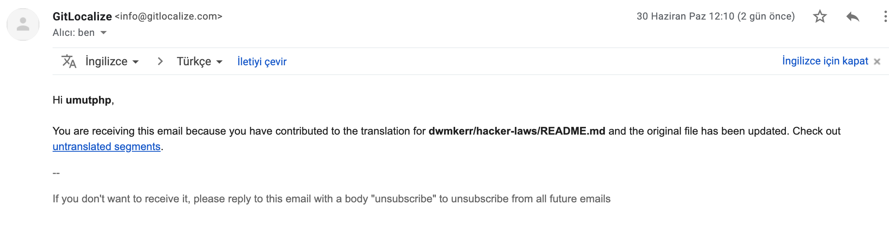

# Contributing Guidelines

<!-- vim-markdown-toc GFM -->

- [Goal of the Project](#goal-of-the-project)
- [Editorial Process](#editorial-process)
- [Example Law: The Law of Leaky Abstractions](#example-law-the-law-of-leaky-abstractions)
- [Translations](#translations)
- [How do I know if a law is relevant?](#how-do-i-know-if-a-law-is-relevant)
- [How do I know if a law is 'well known' enough?](#how-do-i-know-if-a-law-is-well-known-enough)
- [Use of Images](#use-of-images)
- [Developer Guide](#developer-guide)
- [Contributor Credit and a Possible Book](#contributor-credit-and-a-possible-book)

<!-- vim-markdown-toc -->

## Goal of the Project

The goal of this project is to have a set of _concise_ definitions to laws, principles, methodologies and patterns which hackers will find useful. They should be:

1. Short - one or two paragraphs.
2. Include the original source.
3. Quote the law if possible, with the author's name.
4. Link to related laws in the 'See also' section.
5. Include real-world examples if possible in the 'Real-world examples' section.

Some other tips:

- It is fine to include laws which are humorous or not serious.
- If a law does not obviously apply to development or coding, include a paragraph explaining the relevance to technologists.
- Don't worry about managing the table of contents, I can generate it.
- Feel free to include images, but aim to keep it down to one image per law.
- Be careful not to copy-and-paste content (unless it is explicitly quoted), as it might violate copyright.
- Include hyperlinks to referenced material.
- Do not advocate for the law, or aim to be opinionated on the correctness or incorrectness of the law, as this repository is simply the descriptions and links.
- Avoid 'you' when writing. For example, prefer "This law suggests refactoring should be avoided when..." rather than "you should avoid refactoring when...". This keeps the style slightly more formal and avoids seeming like advocation of a law.

## Editorial Process

Every contribution is edited, either before it is merged or shortly afterwards. In practice this means changes to style, tone, structure and length, a check that the description is correct and relevant, and a check that quotes and images are properly attributed.

A law may therefore end up reading quite differently from the version that was submitted. This is not a comment on the quality of the contribution. The aim is to keep a long document in a single voice, and to keep every entry to the same shape and length.

Two things make this much easier:

- Do not copy and paste text from other sources, unless it is explicitly quoted and attributed. See [Use of Images](#use-of-images) for the equivalent point about pictures.
- Include a link to the source for anything you reference, and the licence for any image.

---

## Example Law: The Law of Leaky Abstractions

An example law is shown below, which covers most of the key points.

[The Law of Leaky Abstractions on Joel on Software](https://www.joelonsoftware.com/2002/11/11/the-law-of-leaky-abstractions/)

> All non-trivial abstractions, to some degree, are leaky.
>
> (Joel Spolsky)

This law states that abstractions, which are generally used in computing to simplify working with complicated systems, will in certain situations 'leak' elements of the underlying system, this making the abstraction behave in an unexpected way.

An example might be loading a file and reading its contents. The file system APIs are an _abstraction_ of the lower level kernel systems, which are themselves an abstraction over the physical processes relating to changing data on a magnetic platter (or flash memory for an SSD). In most cases, the abstraction of treating a file like a stream of binary data will work. However, for a magnetic drive, reading data sequentially will be *significantly* faster than random access (due to increased overhead of page faults), but for an SSD drive, this overhead will not be present. Underlying details will need to be understood to deal with this case (for example, database index files are structured to reduce the overhead of random access), the abstraction 'leaks' implementation details the developer may need to be aware of.

The example above can become more complex when _more_ abstractions are introduced. The Linux operating system allows files to be accessed over a network, but represented locally as 'normal' files. This abstraction will 'leak' if there are network failures. If a developer treats these files as 'normal' files, without considering the fact that they may be subject to network latency and failures, the solutions will be buggy.

The article describing the law suggests that an over-reliance on abstractions, combined with a poor understanding of the underlying processes, actually makes dealing with the problem at hand _more_ complex in some cases.

See also:

- [Hyrum's Law](#hyrums-law-the-law-of-implicit-interfaces)

Real-world examples:

- [Photoshop Slow Startup](https://forums.adobe.com/thread/376152) - an issue I encountered in the past. Photoshop would be slow to startup, sometimes taking minutes. It seems the issue was that on startup it reads some information about the current default printer. However, if that printer is actually a network printer, this could take an extremely long time. The _abstraction_ of a network printer being presented to the system similar to a local printer caused an issue for users in poor connectivity situations.

## Translations

We are currently using [GitLocalize](https://gitlocalize.com) to handle translations. This provides features to make it easier for people to manage translations as changes come in:



If you would like to moderate a language, please follow the steps below:

1. Log in to [Git Localize](https://gitlocalize.com) with your GitHub account, this will create a GitLocalize account for you.
0. [Open an Issue](https://github.com/dwmkerr/hacker-laws/issues/new) with the name of the language you would like to moderate/translate.
0. [Open a Pull Request](https://github.com/dwmkerr/hacker-laws/compare) that adds your details and the language details to the [Translators](https://github.com/dwmkerr/hacker-laws#translations) section of the README.
3. I will then make you a moderator of the language and ensure the language is listed properly.

Thanks!


## How do I know if a law is relevant?

In general, it should be reasonably applicable to the world of computer sciences, IT or coding in general.

## How do I know if a law is 'well known' enough?

A good test is 'If I search for it on Google, will I find it in the first few results?'.

## Use of Images

Original diagrams are strongly preferred. If you do reference an image from elsewhere, please include the source URL, the author and the licence in the pull request, so that it can be attributed properly. Images without a clear licence cannot be accepted, and images may later be redrawn to keep the artwork consistent.

Also include a white background, as some viewers will be reading in 'Dark Mode', which can make images with a transparent background difficult to read.

## Developer Guide

Where possible, anything which is not the core `README.md` file is kept in the `.github/` folder to keep the landing page for the repository as clean as possible.

The website at [hacker-laws.com](https://hacker-laws.com) is built from `README.md`. To build and serve it locally:

```bash
cd .github/website
make install
make serve
```

Run `make` on its own to see the other targets.

## Contributor Credit and a Possible Book

This project may in time be turned into a book.

If that happens, every contributor will be credited in an appendix. Contributors are listed by GitHub handle by default. If you would prefer to be credited by name, please say so in your pull request.

By opening a pull request you grant the maintainer a permanent, worldwide, royalty-free and non-exclusive licence to use, edit, translate and publish your contribution in any format, including print and electronic editions which are sold. You keep the copyright in what you wrote, and remain free to use it elsewhere yourself.

The repository stays under [CC BY-SA 4.0](../LICENSE) and will remain free to read.
