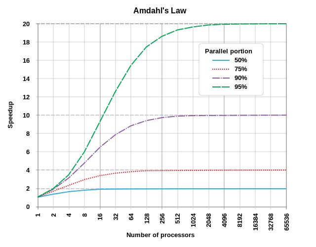
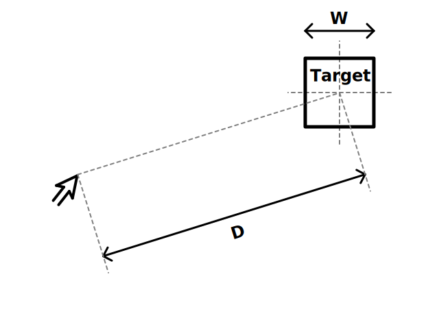
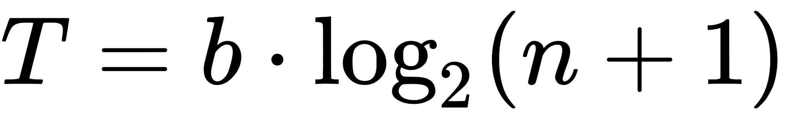
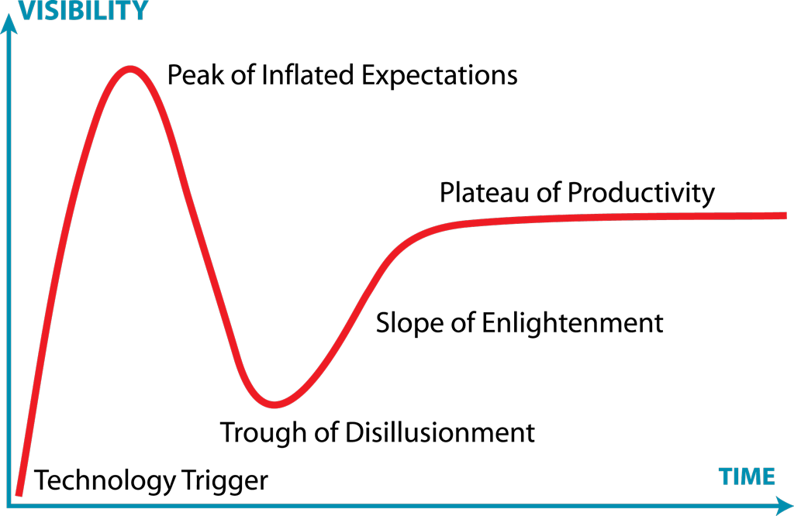
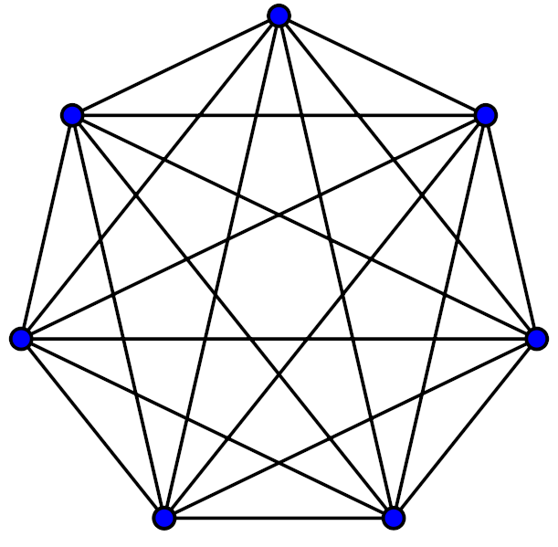
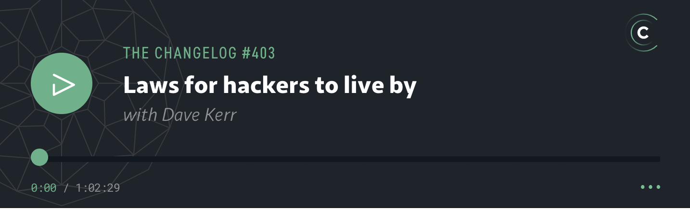

# 💻📖 hacker-laws

Laws, Theories, Principles and Patterns that developers will find useful.

[Translations](#translations): [🇮🇩](./translations/id.md) [🇧🇷](./translations/pt-BR.md) [🇨🇳](https://github.com/nusr/hacker-laws-zh) [🇩🇪](./translations/de.md) [🇫🇷](./translations/fr.md) [🇬🇷](./translations/el.md) [🇮🇹](https://github.com/csparpa/hacker-laws-it) [🇱🇻](./translations/lv.md) [🇰🇷](https://github.com/codeanddonuts/hacker-laws-kr) [🇵🇱](./translations/pl.md) [🇷🇺](https://github.com/solarrust/hacker-laws) [🇪🇸](./translations/es-ES.md) [🇹🇷](https://github.com/umutphp/hacker-laws-tr) [🇯🇵](./translations/jp.md) [🇺🇦](./translations/uk.md)

Like this project? Please considering [sponsoring me](https://github.com/sponsors/dwmkerr) and the [translators](#translations). Also check out this podcast on [The Changelog - Laws for Hackers to Live By](https://changelog.com/podcast/403) to learn more about the project! You can also [download the latest PDF eBook](https://github.com/dwmkerr/hacker-laws/releases/latest/download/hacker-laws.pdf). Check the [Contributor Guide](./.github/contributing.md) if you are keen to contribute!

---

<!-- vim-markdown-toc GFM -->

* [Introduction](#introduction)
* [Laws](#laws)
    * [90–9–1 Principle (1% Rule)](#9091-principle-1-rule)
    * [Amdahl's Law](#amdahls-law)
    * [The Broken Windows Theory](#the-broken-windows-theory)
    * [Brooks' Law](#brooks-law)
    * [CAP Theorem (Brewer's Theorem)](#cap-theorem-brewers-theorem)
    * [Conway's Law](#conways-law)
    * [Cunningham's Law](#cunninghams-law)
    * [Dunbar's Number](#dunbars-number)
    * [The Dunning-Kruger Effect](#the-dunning-kruger-effect)
    * [Fitts' Law](#fitts-law)
    * [Gall's Law](#galls-law)
    * [Goodhart's Law](#goodharts-law)
    * [Hanlon's Razor](#hanlons-razor)
    * [Hick's Law (Hick-Hyman Law)](#hicks-law-hick-hyman-law)
    * [Hofstadter's Law](#hofstadters-law)
    * [Hutber's Law](#hutbers-law)
    * [The Hype Cycle & Amara's Law](#the-hype-cycle--amaras-law)
    * [Hyrum's Law (The Law of Implicit Interfaces)](#hyrums-law-the-law-of-implicit-interfaces)
    * [Kernighan's Law](#kernighans-law)
    * [Linus's Law](#linuss-law)
    * [Metcalfe's Law](#metcalfes-law)
    * [Moore's Law](#moores-law)
    * [Murphy's Law / Sod's Law](#murphys-law--sods-law)
    * [Occam's Razor](#occams-razor)
    * [Parkinson's Law](#parkinsons-law)
    * [Premature Optimization Effect](#premature-optimization-effect)
    * [Putt's Law](#putts-law)
    * [Reed's Law](#reeds-law)
    * [The Law of Conservation of Complexity (Tesler's Law)](#the-law-of-conservation-of-complexity-teslers-law)
    * [The Law of Demeter](#the-law-of-demeter)
    * [The Law of Leaky Abstractions](#the-law-of-leaky-abstractions)
    * [The Law of Triviality](#the-law-of-triviality)
    * [The Unix Philosophy](#the-unix-philosophy)
    * [The Scout Rule](#the-scout-rule)
    * [The Spotify Model](#the-spotify-model)
    * [The Two Pizza Rule](#the-two-pizza-rule)
    * [Wadler's Law](#wadlers-law)
    * [Wheaton's Law](#wheatons-law)
* [Principles](#principles)
    * [All Models Are Wrong (George Box's Law)](#all-models-are-wrong-george-boxs-law)
    * [Chesterton's Fence](#chestertons-fence)
    * [The Dead Sea Effect](#the-dead-sea-effect)
    * [The Dilbert Principle](#the-dilbert-principle)
    * [The Pareto Principle (The 80/20 Rule)](#the-pareto-principle-the-8020-rule)
    * [The Shirky Principle](#the-shirky-principle)
    * [The Peter Principle](#the-peter-principle)
    * [The Robustness Principle (Postel's Law)](#the-robustness-principle-postels-law)
    * [SOLID](#solid)
    * [The Single Responsibility Principle](#the-single-responsibility-principle)
    * [The Open/Closed Principle](#the-openclosed-principle)
    * [The Liskov Substitution Principle](#the-liskov-substitution-principle)
    * [The Interface Segregation Principle](#the-interface-segregation-principle)
    * [The Dependency Inversion Principle](#the-dependency-inversion-principle)
    * [The DRY Principle](#the-dry-principle)
    * [The KISS principle](#the-kiss-principle)
    * [YAGNI](#yagni)
    * [The Fallacies of Distributed Computing](#the-fallacies-of-distributed-computing)
* [Reading List](#reading-list)
* [Online Resources](#online-resources)
* [PDF eBook](#pdf-ebook)
* [Podcast](#podcast)
* [Translations](#translations)
* [Related Projects](#related-projects)
* [Contributing](#contributing)
* [TODO](#todo)

<!-- vim-markdown-toc -->

## Introduction

There are lots of laws which people discuss when talking about development. This repository is a reference and overview of some of the most common ones. Please share and submit PRs!

❗: This repo contains an explanation of some laws, principles and patterns, but does not _advocate_ for any of them. Whether they should be applied will always be a matter of debate, and greatly dependent on what you are working on.

## Laws

And here we go!

### 90–9–1 Principle (1% Rule)

[1% Rule on Wikipedia](https://en.wikipedia.org/wiki/1%25_rule_(Internet_culture))

The 90-9-1 principle suggests that within an internet community such as a wiki, 90% of participants only consume content, 9% edit or modify content and 1% of participants add content.

Real-world examples:

- A 2014 study of four digital health social networks found the top 1% created 73% of posts, the next 9% accounted for an average of ~25% and the remaining 90% accounted for an average of 2% ([Reference](https://www.jmir.org/2014/2/e33/))

See Also:

- [Pareto principle](#the-pareto-principle-the-8020-rule)

### Amdahl's Law

[Amdahl's Law on Wikipedia](https://en.wikipedia.org/wiki/Amdahl%27s_law)

> Amdahl's Law is a formula which shows the _potential speedup_ of a computational task which can be achieved by increasing the resources of a system. Normally used in parallel computing, it can predict the actual benefit of increasing the number of processors, which is limited by the parallelisability of the program.

Best illustrated with an example. If a program is made up of two parts, part A, which must be executed by a single processor, and part B, which can be parallelised, then we see that adding multiple processors to the system executing the program can only have a limited benefit. It can potentially greatly improve the speed of part B - but the speed of part A will remain unchanged.

The diagram below shows some examples of potential improvements in speed:

*(Image Reference: By Daniels219 at English Wikipedia, Creative Commons Attribution-Share Alike 3.0 Unported, https://en.wikipedia.org/wiki/File:AmdahlsLaw.svg)*

As can be seen, even a program which is 50% parallelisable will benefit very little beyond 10 processing units, whereas a program which is 95% parallelisable can still achieve significant speed improvements with over a thousand processing units.

As [Moore's Law](#moores-law) slows, and the acceleration of individual processor speed slows, parallelisation is key to improving performance. Graphics programming is an excellent example - with modern Shader based computing, individual pixels or fragments can be rendered in parallel - this is why modern graphics cards often have many thousands of processing cores (GPUs or Shader Units).

See also:

- [Brooks' Law](#brooks-law)
- [Moore's Law](#moores-law)

### The Broken Windows Theory

[The Broken Windows Theory on Wikipedia](https://en.wikipedia.org/wiki/Broken_windows_theory)

The Broken Windows Theory suggests that visible signs of crime (or lack of care of an environment) lead to further and more serious crimes (or further deterioration of the environment).

This theory has been applied to software development, suggesting that poor quality code (or [Technical Debt](#TODO)) can lead to a perception that efforts to improve quality may be ignored or undervalued, thus leading to further poor quality code. This effect cascades leading to a great decrease in quality over time.

See also:

- [Technical Debt](#TODO)

Examples:

- [The Pragmatic Programming: Software Entropy](https://flylib.com/books/en/1.315.1.15/1/)
- [Coding Horror: The Broken Window Theory](https://blog.codinghorror.com/the-broken-window-theory/)
- [OpenSource: Joy of Programming - The Broken Window Theory](https://opensourceforu.com/2011/05/joy-of-programming-broken-window-theory/)

### Brooks' Law

[Brooks' Law on Wikipedia](https://en.wikipedia.org/wiki/Brooks%27s_law)

> Adding human resources to a late software development project makes it later.

This law suggests that in many cases, attempting to accelerate the delivery of a project which is already late, by adding more people, will make the delivery even later. Brooks is clear that this is an over-simplification, however, the general reasoning is that given the ramp up time of new resources and the communication overheads, in the immediate short-term velocity decreases. Also, many tasks may not be divisible, i.e. easily distributed between more resources, meaning the potential velocity increase is also lower.

The common phrase in delivery "Nine women can't make a baby in one month" relates to Brooks' Law, in particular, the fact that some kinds of work are not divisible or parallelisable.

This is a central theme of the book '[The Mythical Man Month](#reading-list)'.

See also:

- [Death March](#todo)
- [Reading List: The Mythical Man Month](#reading-list)

### CAP Theorem (Brewer's Theorem)

The CAP Theorem (defined by Eric Brewer) states that for a distributed data store only two out of the following three guarantees (at most) can be made:

- Consistency: when reading data, every request receives the _most recent_ data or an error is returned
- Availability: when reading data, every request receives _a non error response_, without the guarantee that it is the _most recent_ data
- Partition Tolerance: when an arbitrary number of network requests between nodes fail, the system continues to operate as expected

The core of the reasoning is as follows. It is impossible to guarantee that a network partition will not occur (see [The Fallacies of Distributed Computing](#the-fallacies-of-distributed-computing)). Therefore in the case of a partition we can either cancel the operation (increasing consistency and decreasing availability) or proceed (increasing availability but decreasing consistency).

The name comes from the first letters of the guarantees (Consistency, Availability, Partition Tolerance). Note that it is very important to be aware that this does _not_ relate to [_ACID_](#TODO), which has a different definition of consistency. More recently, [PACELC](#TODO) theorem has been developed which adds constraints for latency and consistency when the network is _not_ partitioned (i.e. when the system is operating as expected).

Most modern database platforms acknowledge this theorem implicitly by offering the user of the database the option to choose between whether they want a highly available operation (which might include a 'dirty read') or a highly consistent operation (for example a 'quorum acknowledged write').

Real world examples:

- [Inside Google Cloud Spanner and the CAP Theorem](https://cloud.google.com/blog/products/gcp/inside-cloud-spanner-and-the-cap-theorem) - Goes into the details of how Cloud Spanner works, which appears at first to seem like a platform which has _all_ of the guarantees of CAP, but under the hood is essentially a CP system.

See also:

- [ACID](#TODO)
- [The Fallacies of Distributed Computing](#the-fallacies-of-distributed-computing)
- [PACELC](#TODO)

### Conway's Law

[Conway's Law on Wikipedia](https://en.wikipedia.org/wiki/Conway%27s_law)

This law suggests that the technical boundaries of a system will reflect the structure of the organisation. It is commonly referred to when looking at organisation improvements, Conway's Law suggests that if an organisation is structured into many small, disconnected units, the software it produces will be. If an organisation is built more around 'verticals' which are orientated around features or services, the software systems will also reflect this.

See also:

- [The Spotify Model](#the-spotify-model)

### Cunningham's Law

[Cunningham's Law on Wikipedia](https://en.wikipedia.org/wiki/Ward_Cunningham#Cunningham's_Law)

> The best way to get the right answer on the Internet is not to ask a question, it's to post the wrong answer.

According to Steven McGeady, Ward Cunningham advised him in the early 1980s: "The best way to get the right answer on the Internet is not to ask a question, it's to post the wrong answer." McGeady dubbed this Cunningham's law, though Cunningham denies ownership calling it a "misquote." Although originally referring to interactions on Usenet, the law has been used to describe how other online communities work (e.g., Wikipedia, Reddit, Twitter, Facebook).

See also:

- [XKCD 386: "Duty Calls"](https://xkcd.com/386/)

### Dunbar's Number

[Dunbar's Number on Wikipedia](https://en.wikipedia.org/wiki/Dunbar%27s_number)

"Dunbar's number is a suggested cognitive limit to the number of people with whom one can maintain stable social relationships— relationships in which an individual knows who each person is and how each person relates to every other person." There is some disagreement to the exact number. "... [Dunbar] proposed that humans can comfortably maintain only 150 stable relationships." He put the number into a more social context, "the number of people you would not feel embarrassed about joining uninvited for a drink if you happened to bump into them in a bar." Estimates for the number generally lay between 100 and 250.

Like stable relationships between individuals, a developer's relationship with a codebase takes effort to maintain. When faced with large complicated projects, or ownership of many projects we lean on convention, policy, and modeled procedure to scale. Dunbar's number is not only important to keep in mind as an office grows, but also when setting the scope for team efforts or deciding when a system should invest in tooling to assist in modeling and automating logistical overhead. Putting the number into an engineering context, it is the number of projects (or normalized complexity of a single project) for which you would feel confident in joining an on-call rotation to support.

See also:

- [Conway's Law](#conways-law)

### The Dunning-Kruger Effect

[The Dunning-Kruger Effect on Wikipedia](https://en.wikipedia.org/wiki/Dunning%E2%80%93Kruger_effect)

> If you're incompetent, you can't know you're incompetent... The skills you need to produce a right answer are exactly the skills you need to recognize what a right answer is.
>
> ([David Dunning](https://en.wikipedia.org/wiki/David_Dunning))

The Dunning–Kruger effect is a theoretical cognitive bias which was described by David Dunning and Justin Kruger in a 1999 psychological study and paper. The study suggests that people with a low level of ability at a task are likely to overestimate their ability of the task. The proposed reason for this bias is that a sufficient _awareness_ of the complexity of a problem or domain is required for a person to be able to make an informed opinion of their capability to work in that domain.

The Dunning-Kruger effect has sometimes been used to describe a related, but not necessarily implied effect which could be described as "The less a person understands a domain, the more they are likely to believe they can easily solve problems in that domain, as they are more likely to see the domain as _simple_". This more general effect is highly relevant in technology. It would suggest that people who are less familiar with a domain, such as non-technical team members or less experienced team members, are more likely to _underestimate_ the effort required to solve a problem in this space.

As a person's understanding and experience in a domain grows, they may well encounter another effect, which is that they tend to _overestimate_ the ability of _others_ or _underestimate_ their own ability, as they are have become so experienced in the domain. In all cases these effects are _cognitive biases_. As with any bias, an understanding that it may be present will often be sufficient to help avoid the challenges - as when there is awareness of a bias more inputs and opinions can be included to attempt to eliminate these biases. A closely related is the bias of [Illusory superiority](https://en.wikipedia.org/wiki/Illusory_superiority).

Real-world examples:

* [Apple vs. FBI: Why This Anti-Terror Hawk Switched Sides](https://fortune.com/2016/03/10/apple-fbi-lindsay-graham/) - In 2016 Senator Lindsey Graham changed his stance on Apple creating a 'backdoor' in their encryption of devices. Initially Graham had been critical of Apple challenging a request to create a 'backdoor', which he saw as necessary to investigate potential terrorist plots. However, by Graham's own admission, as he learned more about the technical complexity of the domain, he realised that he had assumed it to be far more simple than he had realised, and that such a backdoor could have serious negative consequences. This could potentially be considered an example of the Dunning-Kruger effect - a cyber-security expert would likely understand immediately how such a backdoor could be exploited, as they have deep understanding of the domain, a layperson might assume that phone security is more similar to _physical security_ where the practice of having a 'master key' for law enforcement is possible, but this analogy does not apply sufficiently well to describe modern encryption in cyber-security. 

### Fitts' Law

[Fitts' Law on Wikipedia](https://en.wikipedia.org/wiki/Fitts%27s_law)

Fitts' law predicts that the time required to move to a target area is a function of the distance to the target divided by the width of the target.

*(Image Reference: By Foobar628 at English Wikipedia, Creative Commons Attribution-Share Alike 3.0 Unported, https://en.wikipedia.org/wiki/Fitts%27s_law#/media/File:Fitts_Law.svg)*

The consequences of this law dictate that when designing UX or UI, interactive elements should be as large as possible and the distance between the users attention area and interactive element should be as small as possible. This has consequences on design, such as grouping tasks that are commonly used with one another close.

It also formalises the concept of 'magic corners', the corners of the screen to which a user can 'sweep' their mouse to easily hit - which is where key UI elements can be placed. The Windows Start button is in a magic corner, making it easy to select, and as an interesting contrast, the MacOS 'close window' button is _not_ in a magic corner, making it hard to hit by mistake.

See also:

- [The information capacity of the human motor system in controlling the amplitude of movement.](https://www.semanticscholar.org/paper/The-information-capacity-of-the-human-motor-system-Fitts/634c9fde5f1c411e4487658ac738dcf18d98ea8d)

### Gall's Law

[Gall's Law on Wikipedia](https://en.wikipedia.org/wiki/John_Gall_(author)#Gall's_law)

> A complex system that works is invariably found to have evolved from a simple system that worked. A complex system designed from scratch never works and cannot be patched up to make it work. You have to start over with a working simple system.
>
> ([John Gall](https://en.wikipedia.org/wiki/John_Gall_(author)))

Gall's Law implies that attempts to _design_ highly complex systems are likely to fail. Highly complex systems are rarely built in one go, but evolve instead from more simple systems.

The classic example is the world-wide-web. In its current state, it is a highly complex system. However, it was defined initially as a simple way to share content between academic institutions. It was very successful in meeting these goals and evolved to become more complex over time.

See also:

- [KISS (Keep It Simple, Stupid)](#the-kiss-principle)

### Goodhart's Law

[The Goodhart's Law on Wikipedia](https://en.wikipedia.org/wiki/Goodhart's_law)

> Any observed statistical regularity will tend to collapse once pressure is placed upon it for control purposes.
>
> _Charles Goodhart_

Also commonly referenced as:

> When a measure becomes a target, it ceases to be a good measure.
>
> _Marilyn Strathern_

The law states that the measure-driven optimizations could lead to devaluation of the measurement outcome itself. Overly selective set of measures ([KPIs](https://en.wikipedia.org/wiki/Performance_indicator)) blindly applied to a process results in distorted effect. People tend to optimize locally by "gaming" the system in order to satisfy particular metrics instead of paying attention to holistic outcome of their actions.

Real-world examples:
- Assert-free tests satisfy the code coverage expectation, despite the fact that the metric intent was to create well-tested software.
- Developer performance score indicated by the number of lines committed leads to unjustifiably bloated codebase.

See also:
- [Goodhart’s Law: How Measuring The Wrong Things Drive Immoral Behaviour](https://coffeeandjunk.com/goodharts-campbells-law/)
- [Dilbert on bug-free software](https://dilbert.com/strip/1995-11-13)

### Hanlon's Razor

[Hanlon's Razor on Wikipedia](https://en.wikipedia.org/wiki/Hanlon%27s_razor)

> Never attribute to malice that which is adequately explained by stupidity.
>
> Robert J. Hanlon

This principle suggests that actions resulting in a negative outcome were not a result of ill will. Instead the negative outcome is more likely attributed to those actions and/or the impact being not fully understood.

### Hick's Law (Hick-Hyman Law)

[Hick's law on Wikipedia](https://en.wikipedia.org/wiki/Hick%27s_law)

> Decision time grows logarithmically with the number of options you can choose from.
>
> William Edmund Hick and Ray Hyman

In the equation below, `T` is the time to make a decision, `n` is the number of options, and `b` is a constant which is determined by analysis of the data.

*(Image Reference: Creative Commons Attribution-Share Alike 3.0 Unported, https://en.wikipedia.org/wiki/Hick%27s_law)*

This law only applies when the number of options is _ordered_, for example, alphabetically. This is implied in the base two logarithm - which implies the decision maker is essentially performing a _binary search_. If the options are not well ordered, experiments show the time taken is linear.

This is has significant impact in UI design; ensuring that users can easily search through options leads to faster decision making.

A correlation has also been shown in Hick's Law between IQ and reaction time as shown in [Speed of Information Processing: Developmental Change and Links to Intelligence](https://www.sciencedirect.com/science/article/pii/S0022440599000369).

See also:
- [Fitts's Law](#fitts-law)

### Hofstadter's Law

[Hofstadter's Law on Wikipedia](https://en.wikipedia.org/wiki/Hofstadter%27s_law)

> It always takes longer than you expect, even when you take into account Hofstadter's Law.
>
> (Douglas Hofstadter)

You might hear this law referred to when looking at estimates for how long something will take. It seems a truism in software development that we tend to not be very good at accurately estimating how long something will take to deliver.

This is from the book '[Gödel, Escher, Bach: An Eternal Golden Braid](#reading-list)'.

See also:

- [Reading List: Gödel, Escher, Bach: An Eternal Golden Braid](#reading-list)

### Hutber's Law

[Hutber's Law on Wikipedia](https://en.wikipedia.org/wiki/Hutber%27s_law)

> Improvement means deterioration.
>
> ([Patrick Hutber](https://en.wikipedia.org/wiki/Patrick_Hutber))

This law suggests that improvements to a system will lead to deterioration in other parts, or it will hide other deterioration, leading overall to a degradation from the current state of the system.

For example, a decrease in response latency for a particular end-point could cause increased throughput and capacity issues further along in a request flow, affecting an entirely different sub-system.

### The Hype Cycle & Amara's Law

[The Hype Cycle on Wikipedia](https://en.wikipedia.org/wiki/Hype_cycle)

> We tend to overestimate the effect of a technology in the short run and underestimate the effect in the long run.
>
> (Roy Amara)

The Hype Cycle is a visual representation of the excitement and development of technology over time, originally produced by Gartner. It is best shown with a visual:

*(Image Reference: By Jeremykemp at English Wikipedia, CC BY-SA 3.0, https://commons.wikimedia.org/w/index.php?curid=10547051)*

In short, this cycle suggests that there is typically a burst of excitement around new technology and its potential impact. Teams often jump into these technologies quickly, and sometimes find themselves disappointed with the results. This might be because the technology is not yet mature enough, or real-world applications are not yet fully realised. After a certain amount of time, the capabilities of the technology increase and practical opportunities to use it increase, and teams can finally become productive. Roy Amara's quote sums this up most succinctly - "We tend to overestimate the effect of a technology in the short run and underestimate in the long run".

### Hyrum's Law (The Law of Implicit Interfaces)

[Hyrum's Law Online](http://www.hyrumslaw.com/)

> With a sufficient number of users of an API,
> it does not matter what you promise in the contract:
> all observable behaviours of your system
> will be depended on by somebody.
>
> (Hyrum Wright)

Hyrum's Law states that when you have a _large enough number of consumers_ of an API, all behaviours of the API (even those not defined as part of a public contract) will eventually come to be depended on by someone. A trivial example may be non-functional elements such as the response time of an API. A more subtle example might be consumers who are relying on applying a regex to an error message to determine the *type* of error of an API. Even if the public contract of the API states nothing about the contents of the message, indicating users should use an associated error code, _some_ users may use the message, and changing the message essentially breaks the API for those users.

See also:

- [The Law of Leaky Abstractions](#the-law-of-leaky-abstractions)
- [XKCD 1172](https://xkcd.com/1172/)

### Kernighan's Law

> Debugging is twice as hard as writing the code in the first place. Therefore, if you write the code as cleverly as possible, you are, by definition, not smart enough to debug it.
>
> (Brian Kernighan)

Kernighan's Law is named for [Brian Kernighan](https://en.wikipedia.org/wiki/Brian_Kernighan) and derived from a quote from Kernighan and Plauger's book [The Elements of Programming Style](https://en.wikipedia.org/wiki/The_Elements_of_Programming_Style):

> Everyone knows that debugging is twice as hard as writing a program in the first place. So if you're as clever as you can be when you write it, how will you ever debug it?

While hyperbolic, Kernighan's Law makes the argument that simple code is to be preferred over complex code, because debugging any issues that arise in complex code may be costly or even infeasible.

See also:

- [The KISS Principle](#the-kiss-principle)
- [The Unix Philosophy](#the-unix-philosophy)
- [Occam's Razor](#occams-razor)

### Linus's Law

[Linus's Law on Wikipedia](https://en.wikipedia.org/wiki/Linus%27s_law)

> Given enough eyeballs, all bugs are shallow.
>
> _Eric S. Raymond_

This law simply states that the more people who can see a problem, the higher the likelihood that someone will have seen and solved the problem before, or something very similar.

Although it was originally used to describe the value of open-source models for projects it can be accepted for any kind of software project. It can also be extended to processes - more code reviews, more static analysis and multi-disciplined test processes will make the problems more visible and easy to identify.

A more formal statement can be:

> Given a large enough beta-tester and co-developer base, almost every problem will be characterized quickly and can be solved by someone who has encountered a similar problem before.

This law was named in honour of [Linus Torvalds](https://en.wikipedia.org/wiki/Linus_Torvalds) in Eric S. Raymond's book "[The Cathedral and the Bazaar](https://en.wikipedia.org/wiki/The_Cathedral_and_the_Bazaar)".

### Metcalfe's Law

[Metcalfe's Law on Wikipedia](https://en.wikipedia.org/wiki/Metcalfe's_law)

> In network theory, the value of a system grows as approximately the square of the number of users of the system.

This law is based on the number of possible pairwise connections within a system and is closely related to [Reed's Law](#reeds-law). Odlyzko and others have argued that both Reed's Law and Metcalfe's Law overstate the value of the system by not accounting for the limits of human cognition on network effects; see [Dunbar's Number](#dunbars-number).

See also:
- [Reed's Law](#reeds-law)
- [Dunbar's Number](#dunbars-number)

### Moore's Law

[Moore's Law on Wikipedia](https://en.wikipedia.org/wiki/Moore%27s_law)

> The number of transistors in an integrated circuit doubles approximately every two years.

Often used to illustrate the sheer speed at which semiconductor and chip technology has improved, Moore's prediction has proven to be highly accurate over from the 1970s to the late 2000s. In more recent years, the trend has changed slightly, partly due to [physical limitations on the degree to which components can be miniaturised](https://en.wikipedia.org/wiki/Quantum_tunnelling). However, advancements in parallelisation, and potentially revolutionary changes in semiconductor technology and quantum computing may mean that Moore's Law could continue to hold true for decades to come.

### Murphy's Law / Sod's Law

[Murphy's Law on Wikipedia](https://en.wikipedia.org/wiki/Murphy%27s_law)

> Anything that can go wrong will go wrong.

Related to [Edward A. Murphy, Jr](https://en.wikipedia.org/wiki/Edward_A._Murphy_Jr.) _Murphy's Law_ states that if a thing can go wrong, it will go wrong.

This is a common adage among developers. Sometimes the unexpected happens when developing, testing or even in production. This can also be related to the (more common in British English) _Sod's Law_:

> If something can go wrong, it will, at the worst possible time.

These 'laws' are generally used in a comic sense. However, phenomena such as [_Confirmation Bias_](#TODO) and [_Selection Bias_](#TODO) can lead people to perhaps over-emphasise these laws (the majority of times when things work, they go unnoticed, failures however are more noticeable and draw more discussion).

See Also:

- [Confirmation Bias](#TODO)
- [Selection Bias](#TODO)

### Occam's Razor

[Occam's Razor on Wikipedia](https://en.wikipedia.org/wiki/Occam's_razor)

> Entities should not be multiplied without necessity.
>
> William of Ockham

Occam's razor says that among several possible solutions, the most likely solution is the one with the least number of concepts and assumptions. This solution is the simplest and solves only the given problem, without introducing accidental complexity and possible negative consequences.

See also:

- [YAGNI](#yagni)
- [No Silver Bullet: Accidental Complexity and Essential Complexity](https://en.wikipedia.org/wiki/No_Silver_Bullet)

Example:

- [Lean Software Development: Eliminate Waste](https://en.wikipedia.org/wiki/Lean_software_development#Eliminate_waste)

### Parkinson's Law

[Parkinson's Law on Wikipedia](https://en.wikipedia.org/wiki/Parkinson%27s_law)

> Work expands so as to fill the time available for its completion.

In its original context, this Law was based on studies of bureaucracies. It may be pessimistically applied to software development initiatives, the theory being that teams will be inefficient until deadlines near, then rush to complete work by the deadline, thus making the actual deadline somewhat arbitrary.

If this law were combined with [Hofstadter's Law](#hofstadters-law), an even more pessimistic viewpoint is reached - work will expand to fill the time available for its completion and *still take longer than expected*.

See also:

- [Hofstadter's Law](#hofstadters-law)

### Premature Optimization Effect

[Premature Optimization on WikiWikiWeb](http://wiki.c2.com/?PrematureOptimization)

> Premature optimization is the root of all evil.
>
> [(Donald Knuth)](https://twitter.com/realdonaldknuth?lang=en)

In Donald Knuth's paper [Structured Programming With Go To Statements](http://wiki.c2.com/?StructuredProgrammingWithGoToStatements), he wrote: "Programmers waste enormous amounts of time thinking about, or worrying about, the speed of noncritical parts of their programs, and these attempts at efficiency actually have a strong negative impact when debugging and maintenance are considered. We should forget about small efficiencies, say about 97% of the time: **premature optimization is the root of all evil**. Yet we should not pass up our opportunities in that critical 3%."

However, _Premature Optimization_ can be defined (in less loaded terms) as optimizing before we know that we need to.

### Putt's Law

[Putt's Law on Wikipedia](https://en.wikipedia.org/wiki/Putt%27s_Law_and_the_Successful_Technocrat)

> Technology is dominated by two types of people, those who understand what they do not manage and those who manage what they do not understand.

Putt's Law is often followed by Putt's Corollary:

> Every technical hierarchy, in time, develops a competence inversion.

These statements suggest that due to various selection criteria and trends in how groups organise, there will be a number of skilled people at working levels of a technical organisations, and a number of people in managerial roles who are not aware of the complexities and challenges of the work they are managing. This can be due to phenomena such as [The Peter Principle](#the-peter-principle) or [The Dilbert Principle](#the-dilbert-principle).

However, it should be stressed that Laws such as this are vast generalisations and may apply to _some_ types of organisations, and not apply to others.

See also:

- [The Peter Principle](#the-peter-principle)
- [The Dilbert Principle](#the-dilbert-principle)

### Reed's Law

[Reed's Law on Wikipedia](https://en.wikipedia.org/wiki/Reed's_law)

> The utility of large networks, particularly social networks, scales exponentially with the size of the network.

This law is based on graph theory, where the utility scales as the number of possible sub-groups, which is faster than the number of participants or the number of possible pairwise connections. Odlyzko and others have argued that Reed's Law overstates the utility of the system by not accounting for the limits of human cognition on network effects; see [Dunbar's Number](#dunbars-number).

See also:
- [Metcalfe's Law](#metcalfes-law)
- [Dunbar's Number](#dunbars-number)

### The Law of Conservation of Complexity (Tesler's Law)

[The Law of Conservation of Complexity on Wikipedia](https://en.wikipedia.org/wiki/Law_of_conservation_of_complexity)

This law states that there is a certain amount of complexity in a system which cannot be reduced.

Some complexity in a system is 'inadvertent'. It is a consequence of poor structure, mistakes, or just bad modeling of a problem to solve. Inadvertent complexity can be reduced (or eliminated). However, some complexity is 'intrinsic' as a consequence of the complexity inherent in the problem being solved. This complexity can be moved, but not eliminated.

One interesting element to this law is the suggestion that even by simplifying the entire system, the intrinsic complexity is not reduced, it is _moved to the user_, who must behave in a more complex way.

### The Law of Demeter

[The Law of Demeter on Wikipedia](https://en.wikipedia.org/wiki/Law_of_Demeter)

> Don't talk to strangers.

The Law of Demeter, also known as "The Principle of Least Knowledge" is a principle for software design, particularly relevant in object orientated languages.

It states that a unit of software should talk only to its immediate collaborators. An object `A` with a reference to object `B` can call its methods, but if `B` has a reference to object `C`, `A` should not call `C`s methods. So, if `C` has a `doThing()` method, `A` should not invoke it directly; `B.getC().doThis()`.

Following this principal limits the scope of changes, making them easier and safer in future.

### The Law of Leaky Abstractions

[The Law of Leaky Abstractions on Joel on Software](https://www.joelonsoftware.com/2002/11/11/the-law-of-leaky-abstractions/)

> All non-trivial abstractions, to some degree, are leaky.
>
> ([Joel Spolsky](https://twitter.com/spolsky))

This law states that abstractions, which are generally used in computing to simplify working with complicated systems, will in certain situations 'leak' elements of the underlying system, this making the abstraction behave in an unexpected way.

An example might be loading a file and reading its contents. The file system APIs are an _abstraction_ of the lower level kernel systems, which are themselves an abstraction over the physical processes relating to changing data on a magnetic platter (or flash memory for an SSD). In most cases, the abstraction of treating a file like a stream of binary data will work. However, for a magnetic drive, reading data sequentially will be *significantly* faster than random access (due to increased overhead of page faults), but for an SSD drive, this overhead will not be present. Underlying details will need to be understood to deal with this case (for example, database index files are structured to reduce the overhead of random access), the abstraction 'leaks' implementation details the developer may need to be aware of.

The example above can become more complex when _more_ abstractions are introduced. The Linux operating system allows files to be accessed over a network but represented locally as 'normal' files. This abstraction will 'leak' if there are network failures. If a developer treats these files as 'normal' files, without considering the fact that they may be subject to network latency and failures, the solutions will be buggy.

The article describing the law suggests that an over-reliance on abstractions, combined with a poor understanding of the underlying processes, actually makes dealing with the problem at hand _more_ complex in some cases.

See also:

- [Hyrum's Law](#hyrums-law-the-law-of-implicit-interfaces)

Real-world examples:

- [Photoshop Slow Startup](https://forums.adobe.com/thread/376152) - an issue I encountered in the past. Photoshop would be slow to startup, sometimes taking minutes. It seems the issue was that on startup it reads some information about the current default printer. However, if that printer is actually a network printer, this could take an extremely long time. The _abstraction_ of a network printer being presented to the system similar to a local printer caused an issue for users in poor connectivity situations.

### The Law of Triviality

[The Law of Triviality on Wikipedia](https://en.wikipedia.org/wiki/Law_of_triviality)

This law suggests that groups will give far more time and attention to trivial or cosmetic issues rather than serious and substantial ones.

The common fictional example used is that of a committee approving plans for nuclear power plant, who spend the majority of their time discussing the structure of the bike shed, rather than the far more important design for the power plant itself. It can be difficult to give valuable input on discussions about very large, complex topics without a high degree of subject matter expertise or preparation. However, people want to be seen to be contributing valuable input. Hence a tendency to focus too much time on small details, which can be reasoned about easily, but are not necessarily of particular importance.

The fictional example above led to the usage of the term 'Bike Shedding' as an expression for wasting time on trivial details. A related term is '[Yak Shaving](https://en.wiktionary.org/wiki/yak_shaving),' which connotes a seemingly irrelevant activity that is part of a long chain of prerequisites to the main task.

### The Unix Philosophy

[The Unix Philosophy on Wikipedia](https://en.wikipedia.org/wiki/Unix_philosophy)

The Unix Philosophy is that software components should be small, and focused on doing one specific thing well. This can make it easier to build systems by composing together small, simple, well-defined units, rather than using large, complex, multi-purpose programs.

Modern practices like 'Microservice Architecture' can be thought of as an application of this law, where services are small, focused and do one specific thing, allowing complex behaviour to be composed of simple building blocks.

### The Scout Rule

[The Scout Rule on O'Reilly](https://www.oreilly.com/library/view/97-things-every/9780596809515/ch08.html)

> Always leave the code better than you found it.
>
> (Robert C. Martin (Uncle Bob))

Based on the "Scout Rule", which is "always leave the campground cleaner than you found it", the Scout Rule in programming is simply "always leave the code cleaner than you found it".

This was introduced in the first chapter of the book [Clean Code](https://www.goodreads.com/book/show/3735293-clean-code) by Bob Martin. The rule suggests that developers should perform 'optimistic refactoring', which means to endeavour to improve the overall quality of the code when you work on it. If you see a mistake, attempt to fix it or clean it up. However, when making changes to code which seems incorrect, it may be worth remembering [Chesterton's Fence](#chestertons-fence)!

See also:

- [Reading List: Clean Code](#reading-list)
- [Chesterton's Fence](#chestertons-fence)
- [The Broken Windows Theory](#broken-windows-theory)

https://www.amazon.sg/Clean-Code-Handbook-Software-Craftsmanship/dp/0132350882

### The Spotify Model

[The Spotify Model on Spotify Labs](https://labs.spotify.com/2014/03/27/spotify-engineering-culture-part-1/)

The Spotify Model is an approach to team and organisation structure which has been popularised by 'Spotify'. In this model, teams are organised around features, rather than technologies.

The Spotify Model also popularises the concepts of Tribes, Guilds, Chapters, which are other components of their organisation structure.

Members of the organisation have described that the actual meaning of these groups changes, evolves and is an on-going experiment. The fact that the model is a _process in motion_, rather than a fixed model continues to lead to varying interpretations of the structure, which may be based on presentations given by employees at conferences. This means 'snapshots' may be 're-packaged' by third parties as a _fixed structure_, with the fact that the model is dynamic being lost.

### The Two Pizza Rule

> If you can't feed a team with two pizzas, it's too large.
>
> (Jeff Bezos)

This rule suggests that regardless of the size of the company, teams should be small enough to be fed by two pizzas. Attributed to Jeff Bezos and Amazon, this belief suggests that large teams are inherently inefficient. This is supported by the fact that as the team size increases linearly, the links between people increases quadratically; thus the cost of coordinating and communicating also grows quadratically. If this cost of coordination is essentially overhead, then smaller teams should be preferred.

The number of links between people can be expressed as `n(n-1)/2` where n = number of people.

### Wadler's Law

[Wadler's Law on wiki.haskell.org](https://wiki.haskell.org/Wadler's_Law)

> In any language design, the total time spent discussing a feature in this list is proportional to two raised to the power of its position.
>
> 0. Semantics
> 1. Syntax
> 2. Lexical syntax
> 3. Lexical syntax of comments
>
> (In short, for every hour spent on semantics, 8 hours will be spent on the syntax of comments).

Similar to [The Law of Triviality](#the-law-of-triviality), Wadler's Law states what when designing a language, the amount of time spent on language structures is disproportionately high in comparison to the importance of those features.

See also:

- [The Law of Triviality](#the-law-of-triviality)

### Wheaton's Law

[The Link](http://www.wheatonslaw.com/)

[The Official Day](https://dontbeadickday.com/)

> Don't be a dick.
>
> _Wil Wheaton_

Coined by Wil Wheaton (Star Trek: The Next Generation, The Big Bang Theory), this simple, concise, and powerful law aims for an increase in harmony and respect within a professional organization. It can be applied when speaking with coworkers, performing code reviews, countering other points of view, critiquing, and in general, most professional interactions humans have with each other.

## Principles

Principles are generally more likely to be guidelines relating to design.

### All Models Are Wrong (George Box's Law)

[All Models Are Wrong](https://en.wikipedia.org/wiki/All_models_are_wrong)

> All models are wrong, but some are useful.
>
> _George Box_

This principle suggests that all models of systems are flawed, but that as long as they are not _too_ flawed they may be useful. This principle has its roots in statistics but applies to scientific and computing models as well.

A fundamental requirement of most software is to model a system of some kind. Regardless of whether the system being modeled is a computer network, a library, a graph of social connections or any other kind of system, the designer will have to decide an appropriate level of detail to model. Excessive detail may lead to too much complexity, too little detail may prevent the model from being functional.

See also:

- [The Law of Leaky Abstractions](#the-law-of-leaky-abstractions)

### Chesterton's Fence

[Chesterton's Fence on Wikipedia](https://en.wikipedia.org/wiki/Wikipedia:Chesterton%27s_fence)

> Reforms should not be made until the reasoning behind the existing state of affairs is understood.

This principle is relevant in software engineering when removing technical debt. Each line of a program was originally written by someone for some reason. Chesterton's Fence suggests that one should try to understand the context and meaning of the code fully, before changing or removing it, even if at first glance it seems redundant or incorrect.

The name of this principle comes from a story by [G.K. Chesterton](https://en.wikipedia.org/wiki/G._K._Chesterton). A man comes across a fence crossing the middle of the road. He complains to the mayor that this useless fence is getting in the way, and asks to remove it. The mayor asks why the fence is there in the first place. When the man says he doesn't know, the mayor says, "If you don't know its purpose, I certainly won't let you remove it. Go and find out the use of it, and then I may let you destroy it."

### The Dead Sea Effect

[The Dead Sea Effect on Bruce F. Webster](http://brucefwebster.com/2008/04/11/the-wetware-crisis-the-dead-sea-effect/)

> "... [T]he more talented and effective IT engineers are the ones most likely to leave - to evaporate ... [those who tend to] remain behind [are] the 'residue' — the least talented and effective IT engineers."
>
> _Bruce F. Webster_

The "Dead Sea Effect" suggests that in any organisation, the skills/talent/efficacy of engineers is often inversely proportional to their time in the company.

Typically, highly skilled engineers find it easy to gain employment elsewhere and are the first to do so. Engineers who have obsolete or weak skills will tend to remain with the company, as finding employment elsewhere is difficult. This is particularly pronounced if they have gained incremental pay rises over their time in the company, as it can be challenging to get equivalent remuneration elsewhere.

### The Dilbert Principle

[The Dilbert Principle on Wikipedia](https://en.wikipedia.org/wiki/Dilbert_principle)

> Companies tend to systematically promote incompetent employees to management to get them out of the workflow.
>
> _Scott Adams_

A management concept developed by Scott Adams (creator of the Dilbert comic strip), the Dilbert Principle is inspired by [The Peter Principle](#the-peter-principle). Under the Dilbert Principle, employees who were never competent are promoted to management in order to limit the damage they can do. Adams first explained the principle in a 1995 Wall Street Journal article, and expanded upon it in his 1996 business book, [The Dilbert Principle](#reading-list).

See Also:

- [The Peter Principle](#the-peter-principle)
- [Putt's Law](#putts-law)

### The Pareto Principle (The 80/20 Rule)

[The Pareto Principle on Wikipedia](https://en.wikipedia.org/wiki/Pareto_principle)

> Most things in life are not distributed evenly.

The Pareto Principle suggests that in some cases, the majority of results come from a minority of inputs:

- 80% of a certain piece of software can be written in 20% of the total allocated time (conversely, the hardest 20% of the code takes 80% of the time)
- 20% of the effort produces 80% of the result
- 20% of the work creates 80% of the revenue
- 20% of the bugs cause 80% of the crashes
- 20% of the features cause 80% of the usage

In the 1940s American-Romanian engineer Dr. Joseph Juran, who is widely credited with being the father of quality control, [began to apply the Pareto principle to quality issues](https://en.wikipedia.org/wiki/Joseph_M._Juran).

This principle is also known as: The 80/20 Rule, The Law of the Vital Few, and The Principle of Factor Sparsity.

Real-world examples:

- In 2002 Microsoft reported that by fixing the top 20% of the most-reported bugs, 80% of the related errors and crashes in windows and office would become eliminated ([Reference](https://www.crn.com/news/security/18821726/microsofts-ceo-80-20-rule-applies-to-bugs-not-just-features.htm)).

### The Shirky Principle

[The Shirky Principle explained](https://kk.org/thetechnium/the-shirky-prin/)

> Institutions will try to preserve the problem to which they are the solution.
>
> _Clay Shirky_

The Shirky Principle suggests that complex solutions - a company, an industry, or a technology - can become so focused on the problem that they are solving, that they can inadvertently perpetuate the problem itself. This may be deliberate (a company striving to find new nuances to a problem which justify continued development of a solution), or inadvertent (being unable or unwilling to accept or build a solution which solves the problem completely or obviates it).

Related to:

- Upton Sinclair's famous line, _"It is difficult to get a man to understand something, when his salary depends upon his not understanding it!"_
- Clay Christensen's _The Innovator's Dilemma_

See also:

- [Pareto Principle](#the-pareto-principle-the-8020-rule)

### The Peter Principle

[The Peter Principle on Wikipedia](https://en.wikipedia.org/wiki/Peter_principle)

> People in a hierarchy tend to rise to their "level of incompetence".
>
> _Laurence J. Peter_

A management concept developed by Laurence J. Peter, the Peter Principle observes that people who are good at their jobs are promoted, until they reach a level where they are no longer successful (their "level of incompetence"). At this point, as they are more senior, they are less likely to be removed from the organisation (unless they perform spectacularly badly) and will continue to reside in a role which they have few intrinsic skills at, as their original skills which made them successful are not necessarily the skills required for their new jobs.

This is of particular interest to engineers - who initially start out in deeply technical roles, but often have a career path which leads to _managing_ other engineers - which requires a fundamentally different skills-set.

See Also:

- [The Dilbert Principle](#the-dilbert-principle)
- [Putt's Law](#putts-law)

### The Robustness Principle (Postel's Law)

[The Robustness Principle on Wikipedia](https://en.wikipedia.org/wiki/Robustness_principle)

> Be conservative in what you do, be liberal in what you accept from others.

Often applied in server application development, this principle states that what you send to others should be as minimal and conformant as possible, but you should aim to allow non-conformant input if it can be processed.

The goal of this principle is to build systems which are robust, as they can handle poorly formed input if the intent can still be understood. However, there are potentially security implications of accepting malformed input, particularly if the processing of such input is not well tested. These implications and other issues are described by Eric Allman in [The Robustness Principle Reconsidered](https://queue.acm.org/detail.cfm?id=1999945).

Allowing non-conformant input, in time, may undermine the ability of protocols to evolve as implementors will eventually rely on this liberality to build their features.

See Also:

- [Hyrum's Law](#hyrums-law-the-law-of-implicit-interfaces)

### SOLID

This is an acronym, which refers to:

* S: [The Single Responsibility Principle](#the-single-responsibility-principle)
* O: [The Open/Closed Principle](#the-openclosed-principle)
* L: [The Liskov Substitution Principle](#the-liskov-substitution-principle)
* I: [The Interface Segregation Principle](#the-interface-segregation-principle)
* D: [The Dependency Inversion Principle](#the-dependency-inversion-principle)

These are key principles in [Object-Oriented Programming](#todo). Design principles such as these should be able to aid developers build more maintainable systems.

### The Single Responsibility Principle

[The Single Responsibility Principle on Wikipedia](https://en.wikipedia.org/wiki/Single_responsibility_principle)

> Every module or class should have a single responsibility only.

The first of the '[SOLID](#solid)' principles. This principle suggests that modules or classes should do one thing and one thing only. In more practical terms, this means that a single, small change to a feature of a program should require a change in one component only. For example, changing how a password is validated for complexity should require a change in only one part of the program.

Theoretically, this should make the code more robust, and easier to change. Knowing that a component which is being changed has a single responsibility only means that _testing_ that change should be easier. Using the earlier example, changing the password complexity component should only be able to affect the features which relate to password complexity. It can be much more difficult to reason about the impact of a change to a component which has many responsibilities.

See also:

- [Object-Oriented Programming](#todo)
- [SOLID](#solid)

### The Open/Closed Principle

[The Open/Closed Principle on Wikipedia](https://en.wikipedia.org/wiki/Open%E2%80%93closed_principle)

> Entities should be open for extension and closed for modification.

The second of the '[SOLID](#solid)' principles. This principle states that entities (which could be classes, modules, functions and so on) should be able to have their behaviour _extended_, but that their _existing_ behaviour should not be able to be modified.

As a hypothetical example, imagine a module which is able to turn a Markdown document into HTML. Now imagine there is a new syntax added to the Markdown specification, which adds support for mathematical equations. The module should be _open to extension_ to implement the new mathematics syntax. However, existing syntax implementations (like paragraphs, bullets, etc) should be _closed for modification_. They already work, we don't want people to change them.

This principle has particular relevance for object-oriented programming, where we may design objects to be easily extended, but would avoid designing objects which can have their existing behaviour changed in unexpected ways.

See also:

- [Object-Oriented Programming](#todo)
- [SOLID](#solid)

### The Liskov Substitution Principle

[The Liskov Substitution Principle on Wikipedia](https://en.wikipedia.org/wiki/Liskov_substitution_principle)

> It should be possible to replace a type with a subtype, without breaking the system.

The third of the '[SOLID](#solid)' principles. This principle states that if a component relies on a type, then it should be able to use subtypes of that type, without the system failing or having to know the details of what that subtype is.

As an example, imagine we have a method which reads an XML document from a structure which represents a file. If the method uses a base type 'file', then anything which derives from 'file' should be able to be used in the function. If 'file' supports seeking in reverse, and the XML parser uses that function, but the derived type 'network file' fails when reverse seeking is attempted, then the 'network file' would be violating the principle.

This principle has particular relevance for object-oriented programming, where type hierarchies must be modeled carefully to avoid confusing users of a system.

See also:

- [Object-Oriented Programming](#todo)
- [SOLID](#solid)

### The Interface Segregation Principle

[The Interface Segregation Principle on Wikipedia](https://en.wikipedia.org/wiki/Interface_segregation_principle)

> No client should be forced to depend on methods it does not use.

The fourth of the '[SOLID](#solid)' principles. This principle states that consumers of a component should not depend on functions of that component which it doesn't actually use.

As an example, imagine we have a method which reads an XML document from a structure which represents a file. It only needs to read bytes, move forwards or move backwards in the file. If this method needs to be updated because an unrelated feature of the file structure changes (such as an update to the permissions model used to represent file security), then the principle has been invalidated. It would be better for the file to implement a 'seekable-stream' interface, and for the XML reader to use that.

This principle has particular relevance for object-oriented programming, where interfaces, hierarchies and abstract types are used to [minimise the coupling](#todo) between different components. [Duck typing](#todo) is a methodology which enforces this principle by eliminating explicit interfaces.

See also:

- [Object-Oriented Programming](#todo)
- [SOLID](#solid)
- [Duck Typing](#todo)
- [Decoupling](#todo)

### The Dependency Inversion Principle

[The Dependency Inversion Principle on Wikipedia](https://en.wikipedia.org/wiki/Dependency_inversion_principle)

> High-level modules should not be dependent on low-level implementations.

The fifth of the '[SOLID](#solid)' principles. This principle states that higher level orchestrating components should not have to know the details of their dependencies.

As an example, imagine we have a program which read metadata from a website. We would assume that the main component would have to know about a component to download the webpage content, then a component which can read the metadata. If we were to take dependency inversion into account, the main component would depend only on an abstract component which can fetch byte data, and then an abstract component which would be able to read metadata from a byte stream. The main component would not know about TCP/IP, HTTP, HTML, etc.

This principle is complex, as it can seem to 'invert' the expected dependencies of a system (hence the name). In practice, it also means that a separate orchestrating component must ensure the correct implementations of abstract types are used (e.g. in the previous example, _something_ must still provide the metadata reader component a HTTP file downloader and HTML meta tag reader). This then touches on patterns such as [Inversion of Control](#todo) and [Dependency Injection](#todo).

See also:

- [Object-Oriented Programming](#todo)
- [SOLID](#solid)
- [Inversion of Control](#todo)
- [Dependency Injection](#todo)

### The DRY Principle

[The DRY Principle on Wikipedia](https://en.wikipedia.org/wiki/Don%27t_repeat_yourself)

> Every piece of knowledge must have a single, unambiguous, authoritative representation within a system.

DRY is an acronym for _Don't Repeat Yourself_. This principle aims to help developers reducing the repetition of code and keep the information in a single place and was cited in 1999 by Andrew Hunt and Dave Thomas in the book [The Pragmatic Developer](https://en.wikipedia.org/wiki/The_Pragmatic_Programmer)

> The opposite of DRY would be _WET_ (Write Everything Twice or We Enjoy Typing).

In practice, if you have the same piece of information in two (or more) different places, you can use DRY to merge them into a single one and reuse it wherever you want/need.

See also:

- [The Pragmatic Developer](https://en.wikipedia.org/wiki/The_Pragmatic_Programmer)

### The KISS principle

[KISS on Wikipedia](https://en.wikipedia.org/wiki/KISS_principle)

> Keep it simple, stupid

The KISS principle states that most systems work best if they are kept simple rather than made complicated; therefore, simplicity should be a key goal in design, and unnecessary complexity should be avoided.  Originating in the U.S. Navy in 1960, the phrase has been associated with aircraft engineer Kelly Johnson.

The principle is best exemplified by the story of Johnson handing a team of design engineers a handful of tools, with the challenge that the jet aircraft they were designing must be repairable by an average mechanic in the field under combat conditions with only these tools. Hence, the "stupid" refers to the relationship between the way things break and the sophistication of the tools available to repair them, not the capabilities of the engineers themselves.

See also:

- [Gall's Law](#galls-law)

### YAGNI

[YAGNI on Wikipedia](https://en.wikipedia.org/wiki/You_ain%27t_gonna_need_it)

This is an acronym for _**Y**ou **A**in't **G**onna **N**eed **I**t_.

> Always implement things when you actually need them, never when you just foresee that you need them.
>
> ([Ron Jeffries](https://twitter.com/RonJeffries)) (XP co-founder and author of the book "Extreme Programming Installed")

This _Extreme Programming_ (XP) principle suggests developers should only implement functionality that is needed for the immediate requirements, and avoid attempts to predict the future by implementing functionality that might be needed later.

Adhering to this principle should reduce the amount of unused code in the codebase, and avoid time and effort being wasted on functionality that brings no value.

See also:

- [Reading List: Extreme Programming Installed](#reading-list)

### The Fallacies of Distributed Computing

[The Fallacies of Distributed Computing on Wikipedia](https://en.wikipedia.org/wiki/Fallacies_of_distributed_computing)

Also known as _Fallacies of Networked Computing_, the Fallacies are a list of conjectures (or beliefs) about distributed computing, which can lead to failures in software development. The assumptions are:

- The network is reliable
- Latency is zero
- Bandwidth is infinite
- The network is secure
- Topology doesn't change
- There is one administrator
- Transport cost is zero
- The network is homogeneous

The first four items were listed by [Bill Joy](https://en.wikipedia.org/wiki/Bill_Joy) and [Tom Lyon](https://twitter.com/aka_pugs) around 1991 and first classified by [James Gosling](https://en.wikipedia.org/wiki/James_Gosling) as the "Fallacies of Networked Computing". [L. Peter Deutsch](https://en.wikipedia.org/wiki/L._Peter_Deutsch) added the 5th, 6th and 7th fallacies. In the late 90's Gosling added the 8th fallacy.

The group was inspired by what was happening at the time inside [Sun Microsystems](https://en.wikipedia.org/wiki/Sun_Microsystems).

These fallacies should be considered carefully when designing code which is resilient; assuming any of these fallacies can lead to flawed logic which fails to deal with the realities and complexities of distributed systems.

See also:

- [Foraging for the Fallacies of Distributed Computing (Part 1) - Vaidehi Joshi
 on Medium](https://medium.com/baseds/foraging-for-the-fallacies-of-distributed-computing-part-1-1b35c3b85b53)

## Reading List

If you have found these concepts interesting, you may enjoy the following books.

- [Clean Code - Robert C. Martin](https://www.goodreads.com/book/show/3735293-clean-code) - One of the most well respected books on how to write clean, maintainable code.
- [Extreme Programming Installed - Ron Jeffries, Ann Anderson, Chet Hendrikson](https://www.goodreads.com/en/book/show/67834) - Covers the core principles of Extreme Programming.
- [Gödel, Escher, Bach: An Eternal Golden Braid - Douglas R. Hofstadter.](https://www.goodreads.com/book/show/24113.G_del_Escher_Bach) - This book is difficult to classify. [Hofstadter's Law](#hofstadters-law) is from the book.
- [Structure and Interpretation of Computer Programs - Harold Abelson, Gerald Jay Sussman, Julie Sussman](https://www.goodreads.com/book/show/43713) - If you were a comp sci or electical engineering student at MIT or Cambridge this was your intro to programming. Widely reported as being a turning point in people's lives.
- [The Cathedral and the Bazaar - Eric S. Raymond](https://en.wikipedia.org/wiki/The_Cathedral_and_the_Bazaar) - a collection of essays on open source. This book was the source of [Linus's Law](#linuss-law).
- [The Dilbert Principle - Scott Adams](https://www.goodreads.com/book/show/85574.The_Dilbert_Principle) - A comic look at corporate America, from the author who created the [Dilbert Principle](#the-dilbert-principle).
- [The Mythical Man Month - Frederick P. Brooks Jr.](https://www.goodreads.com/book/show/13629.The_Mythical_Man_Month) - A classic volume on software engineering. [Brooks' Law](#brooks-law) is a central theme of the book.
- [The Peter Principle - Lawrence J. Peter](https://www.goodreads.com/book/show/890728.The_Peter_Principle) - Another comic look at the challenges of larger organisations and people management, the source of [The Peter Principle](#the-peter-principle).

## Online Resources

Some useful resources and reading.

- [CB Insights: 8 Laws Driving Success In Tech: Amazon's 2-Pizza Rule, The 80/20 Principle, & More](https://www.cbinsights.com/research/report/tech-laws-success-failure) - an interesting write up of some laws which have been highly influential in technology.

## PDF eBook

The project is available as a PDF eBook, [download the latest PDF eBook with this link](https://github.com/dwmkerr/hacker-laws/releases/latest/download/hacker-laws.pdf) or check the [release](https://github.com/dwmkerr/hacker-laws/releases) page for older versions.

A new version of the eBook is created automatically when a new version tag is pushed.

## Podcast

Hacker Laws has been featured in [The Changelog](https://changelog.com/podcast/403), you can check out the Podcast episode with the link below:

## Translations

Thanks to a number of wonderful contributors, Hacker Laws is available in a number of languages. Please consider sponsoring moderators!

| Language | Moderator | Status |
|----------|-----------|--------|
| [🇮🇩 Bahasa Indonesia / Indonesian](./translations/pt-BR.md) | [arywidiantara](https://github.com/arywidiantara) |  |
| [🇧🇷 Brasileiro / Brazilian](./translations/pt-BR.md) | [Eugênio Moreira](https://github.com/eugenioamn), [Leonardo Costa](https://github.com/leofc97) |  |
| [🇨🇳 中文 / Chinese](https://github.com/nusr/hacker-laws-zh) | [Steve Xu](https://github.com/nusr) | Partially complete |
| [🇩🇪 Deutsch / German](./translations/de.md) | [Vikto](https://github.com/viktodergunov) |  |
| [🇫🇷 Français / French](./translations/fr.md) | [Kevin Bockelandt](https://github.com/KevinBockelandt) |  |
| [🇬🇷 ελληνικά / Greek](./translations/el.md) | [Panagiotis Gourgaris](https://github.com/0gap) |  |
| [🇮🇹 Italiano / Italian](https://github.com/csparpa/hacker-laws-it) | [Claudio Sparpaglione](https://github.com/csparpa) | Partially complete |
| [🇯🇵 JP 日本語 / Japanese](./translations/jp.md) | [Fumikazu Fujiwara](https://github.com/freddiefujiwara)|  |
| [🇰🇷 한국어 / Korean](https://github.com/codeanddonuts/hacker-laws-kr) | [Doughnut](https://github.com/codeanddonuts) | Partially complete |
| [🇱🇻 Latviešu Valoda / Latvian](./translations/lv.md) | [Arturs Jansons](https://github.com/iegik) |  |
| [🇵🇱 Polski / Polish](./translations/pl.md) | [Mariusz Kogen](https://github.com/k0gen) |  |
| [🇷🇺 Русская версия / Russian](https://github.com/solarrust/hacker-laws) | [Alena Batitskaya](https://github.com/solarrust) | Partially complete |
| [🇪🇸 Castellano / Spanish](./translations/es-ES.md) | [Manuel Rubio](https://github.com/manuel-rubio) ([Sponsor](https://github.com/sponsors/manuel-rubio)) | Partially complete |
| [🇹🇷 Türkçe / Turkish](https://github.com/umutphp/hacker-laws-tr) | [Umut Işık](https://github.com/umutphp) |  |
| [🇺🇦 українська мова / Ukrainian](./translations/uk.md) | [Nazar](https://github.com/troyane), [Helga Lastivka](https://github.com/HelgaLastivka) |  |

If you would like to update a translation, follow the [Translators Contributor Guide](https://github.com/dwmkerr/hacker-laws/blob/main/.github/contributing.md#translations).

## Related Projects

- [Tip of the Day](https://tips.darekkay.com/html/hacker-laws-en.html) - Receive a daily hacker law/principle.
- [Hacker Laws CLI](https://github.com/umutphp/hacker-laws-cli) - List, view and see random laws from the terminal!
- [Hacker Laws Action](https://github.com/marketplace/actions/hacker-laws-action) - Adds a random Hacker Law to a pull request as a small gift for the contributor, thanks [Umut Işık](https://github.com/umutphp)

## Contributing

Please do contribute! [Raise an issue](https://github.com/dwmkerr/hacker-laws/issues/new) if you'd like to suggest an addition or change, or [Open a pull request](https://github.com/dwmkerr/hacker-laws/compare) to propose your own changes.

Please be sure to read the [Contributing Guidelines](./.github/contributing.md) for requirements on text, style and so on. Please be aware of the [Code of Conduct](./.github/CODE_OF_CONDUCT.md) when engaging in discussions on the project.

## TODO

Hi! If you land here, you've clicked on a link to a topic I've not written up yet, sorry about this - this is work in progress!

Feel free to [Raise an Issue](https://github.com/dwmkerr/hacker-laws/issues) requesting more details, or [Open a Pull Request](https://github.com/dwmkerr/hacker-laws/pulls) to submit your proposed definition of the topic.
