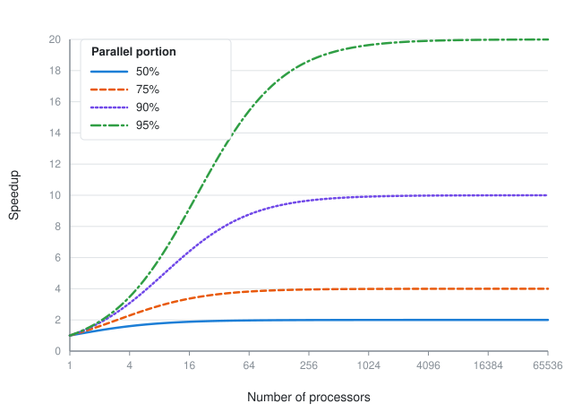
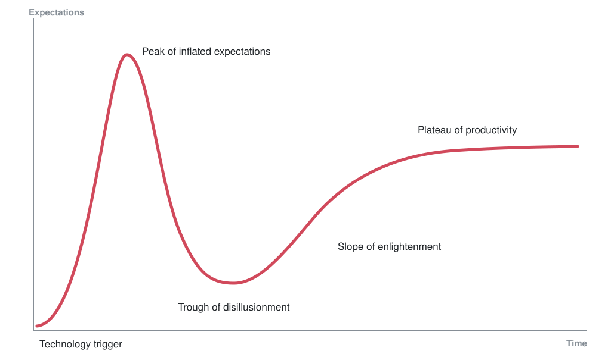

# 💻📖 hacker-laws

Likumi, teorijas, principi un apraksti, kas izstrādātājiem šķitīs noderīgi.

[tulkojumi](#translations): [🇧🇷](./translations/pt-BR.md) [🇨🇳](https://github.com/nusr/hacker-laws-zh) [🇫🇷](./translations/fr.md) [🇮🇹](./translations/it-IT.md) [🇰🇷](https://github.com/codeanddonuts/hacker-laws-kr) [🇷🇺](https://github.com/solarrust/hacker-laws) [🇪🇸](./translations/es-ES.md) [🇹🇷](./translations/tr.md) [🇮🇩](./translations/id.md) [🇯🇵](./translations/jp.md) [🇵🇱](./translations/pl.md) [🇻🇳](./translations/vi.md)

---

<!-- VIM-markdown-toc GFM -->

* [Ievads](#ievads)
* [Likumi](#likumi)
    * [Amdahla likums](#amdahla-likums)
    * [Izsisto logu teorija](#izsisto-logu-teorija)
    * [Brūku likums](#bruku-likums)
    * [Konveja likums](#conways-likums)
    * [Kaningemas likums](#cunninghams-likums)
    * [Danbara numurs](#dunbars-numurs)
    * [Galla likums](#galls-likums)
    * [Goodharta likums](#goodharts-likums)
    * [Hanona Razora](#hanlons-razor)
    * [Hofstadtera likums](#hofstadtera-likums)
    * [Hutbera likums](#hutbera-likums)
    * [Hype Cycle & Amaras likums](#hype-cycle-amaras-likums)
    * [Hyruma likums (Perifērisko saskarņu likums)](#hyruma-likums-perifērisko-saskarņu-likums)
    * [Kernigana likums](#kernigana-likums)
    * [Metkalfa likums](#metkalfa-likums)
    * [Mora likums](#mora-likums)
    * [Mērfija likums/Soda likums](#murphys-sods-likums)
    * [Occam's Razor](#occams-razor)
    * [Parkinsona likums](#parkinsons-Law)
    * [Priekšlaicīgas optimizēšanas efekts](#premature-optimizēšanas-efekts)
    * [Putta likums](#putta-likums)
    * [Reeda likums](#reeda-likums)
    * [Taisnīguma saglabāšanas likums (Teslera likums)](#taisnīguma-saglabāšanas-likums-teslera-likums)
    * [Leaky Abstractions likums](#leaky-Abstractions-likums)
    * [Trivialitātes likums](#trivialitātes-likums)
    * [Unix filozofija](#unix-filozofija)
    * [Spotify modelis](#spotify-modelis)
    * [Wadlera likums](#wadlera-likums)
    * [Wheatona likums](#wheatons-likums)
* [Principi](#principi)
    * [Dilberta princips](#dilberta-princips)
    * [Pareto princips (kārtula 80/20)](#pareto-princips-kārtula-8020)
    * [Petera princips](#petera-princips)
    * [Uzturības princips (Postela likums)](#uzturības-princips-postela-likums)
    * [SOLID](#solid)
    * [Vienotās atbildības princips](#vienotās-atbildības-princips)
    * [Atklātais/slēgtais princips](#atklātaisslēgtais-princips)
    * [Liskova aizstāšanas princips](#liskova-aizstāšanas-princips)
    * [Interfeisa segmenta noteikšanas princips](#interfeisa-segmenta-noteikšanas-princips)
    * [Atkarībās inversijas princips](#atkarības-inversijas-princips)
    * [DRY princips](#dry-princips)
    * [KISS princips](#kiss-princips)
    * [YAGNI](#yagni)
    * [Dalītās datošanas maldības](#dalītās-datošanas-maldības)
* [Lasīšanas saraksts](#lasīšanas-saraksts)
* [Ieguldījums](#ieguldījums)
* [Uzdevums](#TODO)

<!-- VIM-markdown-toc -->

## Ievads

Ir daudz likumu, kurus cilvēki apspriež, runājot par attīstību. Šis repozitorijs ir atsauce un pārskats par dažiem visbiežāk sastopamajiem. Lūdzu, kopīgojiet un iesniedziet PRs!

❗: šis repo satur dažu likumu, principu un modeļu skaidrojumu, bet ne _aizstāv_ nevienam no tiem. Tas, vai tās jāpiemēro, vienmēr būs debašu jautājums un lielā mērā atkarīgs no tā, ar ko jūs strādājat.

## Tiesību akti

Un te nu mēs ejam!

### Amdahl likums

[Amdahl likums Vikipēdijā](https://en.wikipedia.org/wiki/Amdahl%27s_law)

> Amdahl likums ir formula, kas parāda skaitļošanas uzdevuma _increedup_, ko var sasniegt, palielinot sistēmas resursus. Parasti izmanto paralēlā skaitļošanā, tā var paredzēt faktisko labumu no procesoru skaita palielināšanas, ko ierobežo programmas paralēliskās iespējas.

Vislabāk ilustrēts ar piemēru. Ja programma sastāv no divām daļām, daļas A, kas jāizpilda vienam procesoram, un daļas B, ko var līdzināt, mēs redzam, ka vairāku procesoru pievienošana sistēmai, kas izpilda programmu, var sniegt tikai ierobežotu labumu. Tas var ievērojami uzlabot B daļas ātrumu, bet daļas a ĀTRUMS paliks nemainīgs.

Turpmāk redzamajā diagrammā ir parādīti daži iespējamo ātruma uzlabojumu piemēri.

*(Atsauce uz attēlu: Daniels220 angļu valodā Wikipedia, Creative Commons Attribution-Share Alike 3.0 Unported, https://en.wikipedia.org/wiki/File:AmdahlsLaw.svg)*

Kā redzams, pat programma, kas ir 50% parallelisable, gūs ļoti maz vairāk nekā 10 procesoru vienību, bet programma, kas ir 95% parallelisable, joprojām var sasniegt ievērojamus ātruma uzlabojumus ar vairāk nekā tūkstoš procesoriem.

Tā kā [Mora likums](#mora-likums) palēninās un individuālā procesora ātruma paātrināšanās palēninās, paralelizācija ir būtiska, lai uzlabotu veiktspēju. Grafikas programmēšana ir lielisks piemērs - ar mūsdienu Shader bāzes skaitļošanu, atsevišķiem pikseļiem vai fragmentiem var renderēt paralēli - tāpēc mūsdienu grafikas kartēs bieži vien ir daudz tūkstošu apstrādes kodolu (GPUs vai Shader Units).

Skatīt arī:

- [Brūku likums](#brooks-likums)
- [Mora likums](#mora-likums)

### Izsisto logu teorija

[Izsisto logu teorija Vikipēdijā](https://en.wikipedia.org/wiki/Broken_windows_theory)

Izsisto logu teorija liecina, ka redzamas nozieguma pazīmes (vai kādas vides rūpju trūkums) noved pie tālākiem un smagākiem noziegumiem (vai tālākas vides pasliktināšanās).

Šī teorija ir izmantota programmatūras izstrādei, kas liek domāt, ka sliktas kvalitātes kods (vai [Technical Debt](#TODO)) var radīt priekšstatu, ka kvalitātes uzlabošanas centieni var tikt ignorēti vai nepietiekami novērtēti, tādējādi radot vēl vairāk sliktas kvalitātes kodu. Šī efekta kaskādes izraisa ievērojamu kvalitātes samazināšanos laika gaitā.

Skatīt arī:

- [Tehniskais parāds](#TODO)

Piemēri:
- [Pracistic Programming: Software Entropy](https://pragprog.com/the-pragmatic-programmer/extracts/software-entropy)
- [Coding Horror: The Broken Window Theory](https://blog.codinghorror.com/the-break-window-theory/)
- [OpenSource: Joy of Programming - The Broken Window Theory](https://opensourceforu.com/2011/05/joy-of-programming-broken-window-theory/)

### Brūku likums

[Brūku likums Vikipēdijā](https://en.wikipedia.org/wiki/Brooks%27s_law)

> Personāla resursu pievienošana vēlākam programmatūras izstrādes projektam to dara vēlāk.

Šis likums liek domāt, ka daudzos gadījumos mēģinājums paātrināt tāda projekta īstenošanu, kas jau ir novēlots, pieskaitot vairāk cilvēku, padarīs piegādi vēl vēlāku. Bruks ir skaidrs, ka tā ir pārmērīga vienkāršošana, tomēr vispārīgie apsvērumi ir tādi, ka, ņemot vērā jaunu resursu ieviešanas laiku un sakaru pieskaitāmās izmaksas, tuvākajā laikā ātrums samazinās. Turklāt daudzi uzdevumi var nebūt dalāmi, t. i., viegli sadalāmi starp lielākiem resursiem, kas nozīmē, ka arī potenciālais ātruma pieaugums ir mazāks.

Izplatītā frāze “Deviņi sievietes nevar dzemdēt bērnu vienā mēnesī” attiecas uz Brūku likumu, jo īpaši uz faktu, ka daži darba veidi nav dalāmi vai parallelisable.

Šī ir grāmatas “[The Mythical Man Monthly](#lasīšanas-saraksts)” galvenā tēma.

Skatīt arī:

- [Nāves marts](#TODO)
- [reading List: The Mythical Man Month](#reading saraksts)

### Konveja likums

[Conwaya likums Vikipēdijā](https://en.wikipedia.org/wiki/Conway%27s_law)

Šis likums paredz, ka sistēmas tehniskās robežas atspoguļos organizācijas struktūru. Parasti tas tiek pieminēts, aplūkojot organizācijas uzlabojumus, Konveja likums liecina, ka, ja organizācija ir strukturēta uz daudzām mazām, atvienotām vienībām, tad tā ražotā programmatūra būs. Ja organizācija ir vairāk izveidota, izmantojot "vertikāles”, kas ir orientētas uz līdzekļiem vai pakalpojumiem, arī programmatūras sistēmas to atspoguļo.

Skatīt arī:

- [Spotify modelis](#spotify-modelis)

### Kaningemas likums

[Kaningemas likums Vikipēdijā](https://en.wikipedia.org/wiki/Ward_Cunningham#Cunningham_likums)

> Labākais veids, kā iegūt pareizo atbildi internetā, ir neuzdot jautājumu, tas ir, izlikt nepareizu atbildi.

Pēc Stīvena McGeady teiktā, Vords Kaningems astoņdesmito gadu sākumā viņam ieteicis: “Labākais veids, kā iegūt pareizo atbildi internetā, ir neuzdot jautājumu, tas ir, izlikt nepareizu atbildi.” Mcgeady šo Kaningemas likumu nodēvēja par “nepatiesu”, lai gan Kaningems to noliedz. Lai gan sākotnēji tas attiecās uz mijiedarbību ar Usenet, likums ir izmantots, lai aprakstītu, kā darbojas citas tiešsaistes kopienas (piemēram, Wikipedia, Reddit, Twitter, Facebook).

Skatīt arī:

- [XKCD 386: “Duty Calls”](https://xkcd.com/386/)

### Danbara numurs

[Danbara numurs Vikipēdijā](https://en.wikipedia.org/wiki/Dunbar%27s_number)

“Danbara skaitlis ir ieteicams izziņas ierobežojums to cilvēku skaitam, ar kuriem var uzturēt stabilas sociālās attiecības — attiecības, kurās indivīds zina, kas ir katrs cilvēks un kā katrs cilvēks ir saistīts ar katru citu cilvēku.” Ir kādas domstarpības ar precīzu skaitli. “..” “Dunbar” ierosināja, ka cilvēki var mierīgi uzturēt tikai 150 stabilas attiecības.” Viņš ievietoja numuru vairāk sabiedriskā kontekstā, “tik daudz cilvēku, cik jūs nejustos apmulsuši, ka pievienojaties nelūgtam dzērienam, ja jums gadītos ar viņiem ieskrieties bārā.” Aptuvenie skaitļi parasti ir no 100 līdz 250.

Tāpat kā stabilas attiecības starp indivīdiem, arī izstrādātāja attiecības ar kodebīlu prasa pūles uzturēt. Saskaroties ar lieliem sarežģītiem projektiem vai daudzu projektu īpašumtiesībām, mēs paļaujamies uz konvencionālo, politiku un modelēto procedūru mērogu. Danbara numurs ir svarīgs ne tikai biroja izaugsmei, bet arī, nosakot darba grupas darba apjomu vai lemjot par to, kad sistēmai jāiegulda līdzekļi, lai palīdzētu modelēt un automatizēt loģistikas pieskaitāmās izmaksas. Skaitlis tiek iekļauts tehniskā kontekstā, tas ir tādu projektu skaits (vai atsevišķa projekta normalizēta sarežģītība), kuriem jūs justos droši, pievienojoties zvanu rotācijai, lai atbalstītu.

Skatīt arī:

- [Conwaya likums](#conways-likums)

### Galla likums

[Galla likums Vikipēdijā](https://en.wikipedia.org/wiki/John_Gall_(autors)#Gall's_law)

> Salikta sistēmā, kas darbojas, pastāvīgi tiek atrasta, ka tā ir attīstījusies no vienkāršas sistēmas, kas darbojās. Sarežģīta sistēma, kas veidota no nulles, nekad nedarbojas, un to nevar patukšot, lai tā darbotos. Jāsāk ar vienkāršu darba sistēmu.
>
> ([John Gall](https://en.wikipedia.org/wiki/John_Gall_(autors)))

Gall likums nozīmē, ka mēģinājumi _izstrādāt_ ļoti sarežģītas sistēmas var neizdoties. Ļoti sarežģītas sistēmas reti tiek veidotas vienā paņēmienā, bet attīstās no vienkāršākām sistēmām.

Klasiskais piemērs ir vispasaules tīmeklis. Pašreizējā stāvoklī tā ir ļoti sarežģīta sistēma. Tomēr sākotnēji tas tika definēts kā vienkāršs veids satura koplietošanai starp akadēmiskajām institūcijām. Tas bija ļoti veiksmīgs šo mērķu sasniegšanā un attīstījās, lai laika gaitā kļūtu sarežģītāks.

Skatīt arī:

- [KISS (keep It Simple, Stupid)](#kiss-princips)

### Goodharta likums

[Goodharta likums Vikipēdijā](https://en.wikipedia.org/wiki/Goodhart's_law)

> jebkura novērotā statistiskā regularitāte var sabrukt, kad uz to tiek izdarīts spiediens kontroles nolūkā.
>
> _Charles Goodhart_

Bieži minēts arī kā:

> kad pasākums kļūst par mērķi, tas vairs nav labs pasākums.
>
> _Merilinas Strathern_

Likums nosaka, ka pasākuma virzītā optimizācija var izraisīt paša mērījumu rezultāta devalvāciju. Pārāk selektīvs pasākumu kopums ([KPI](https://en.wikipedia.org/wiki/Performance_indicator)), ko akli piemēro procesam, rada izkropļotu ietekmi. Cilvēki mēdz optimizēt vietējā līmenī, “spēlējot” sistēmu, lai tā atbilstu īpašiem rādītājiem, nevis pievērstu uzmanību viņu darbību visaptverošajiem rezultātiem.

Reālpasaules piemēri:

- izmēģinājumi bez pārbaudes atbilst koda pārklājuma prognozēm, neskatoties uz to, ka metrikas nolūks bija izveidot labi pārbaudītu programmatūru.
- izstrādātāja snieguma rezultāts, ko norāda veikto rindu skaits, noved pie nepamatoti uzpūstas kodebāzes.

Skatīt arī:

- [Goodharta likums: How Measuring The Wrong Things Drive Immoral Bemoral haviour](https://coffeeandjunk.com/goodharts-campbells-law/)
- [Dilbert on bug-free software](https://dilbert.com/strip/1995-11-13)

### Hanlons Razors

[Hanlon's Razor Vikipēdijā](https://en.wikipedia.org/wiki/Hanlon%27s_razor)

> nekad nepiedēvē ļaunprātību, kas ir pietiekami izskaidrota ar muļķību.
>
> Roberts J. Hanlons

Šis princips liek domāt, ka darbības, kas rada negatīvu rezultātu, nav sliktas gribas rezultāts. Tā vietā negatīvais iznākums drīzāk tiek attiecināts uz šīm darbībām un/vai ietekme netiek pilnībā izprasta.

### Hofstadtera likums

[Hefstadtera likums Vikipēdijā](https://en.wikipedia.org/wiki/Hofstadter%27s_law)

> Tas vienmēr aizņem vairāk laika, nekā jūs domājat, pat ņemot vērā Hofštera likumu.
>
> (Duglass Hofstadters)

Jūs varētu dzirdēt, kā šis likums tiek pieminēts, skatoties uz aprēķiniem, cik ilgi kaut kas notiks. Šķiet, ka programmatūras izstrādes triks ir tāds, ka mēs nemēdzam precīzi novērtēt, cik ilgs laiks būs vajadzīgs, lai to paveiktu.

Tas ir no grāmatas “[Gödel, Escher, Bahs: An Mūžīgais Zelta Breidijs](#lasīšanas-saraksts)”.

Skatīt arī:

- [Lasīšanas saraksts: Gödel, Escher, Baach: An Mūžīgais zelta Breids](#lasīšanas-saraksts)

### Hutbera likums

[Hutbera likums Vikipēdijā](https://en.wikipedia.org/wiki/Hutber%27s_law)

> Uzlabošanās nozīmē nolietošanos.
>
> ([Patrick Hutber](https://en.wikipedia.org/wiki/Patrick_Hutber))

Šis likums liek domāt, ka sistēmas uzlabojumi novedīs pie citu daļu pasliktināšanās vai arī apslēps citu pasliktināšanos, kas kopumā novedīs pie degradācijas no sistēmas pašreizējā stāvokļa.

Piemēram, atbildes latentuma samazināšanās konkrētā galapunktā varētu radīt papildu caurlaidspējas un jaudas problēmas pieprasījuma plūsmā, ietekmējot pilnīgi citu apakšsistēmu.

### Hype Cycle & Amara likums

[Hype Cycle Vikipēdijā](https://en.wikipedia.org/wiki/Hype_cycle)

> Mēs pārāk augstu vērtējam tehnoloģijas ietekmi īstermiņā un nepietiekami novērtējam tās ietekmi ilgtermiņā.
>
> (Rojs Amara)

Hype Cycle ir Gārtnera sākotnēji ražotās tehnoloģijas saviļņojuma un attīstības vizuāls attēlojums laika gaitā. Vislabāk to rāda vizuāli:

*(Atsauce uz attēlu: angļu valodā Wikipedia, CC BY-SA 3.0, https://commons.wikimedia.org/w/index.php?curid=10547051)*

Īsāk sakot, šis cikls liecina, ka parasti rodas satraukums par jaunām tehnoloģijām un to iespējamo ietekmi. Komandas bieži vien ātri iesoļo šajās tehnoloģijās un reizēm jūtas vīlušās ar rezultātiem. Tas varētu būt tāpēc, ka tehnoloģija vēl nav pietiekami izstrādāta vai arī reālie lietojumi vēl nav pilnībā īstenoti. Pēc zināma laika tehnoloģijas iespējas palielinās un praktiskās iespējas to izmantot palielinās, un komandas beidzot var kļūt ražīgas. Rojs Amars (Roy Amara) citēja šo jautājumu visskaļāk: “Mums ir tendence pārvērtēt tehnoloģijas ietekmi īstermiņā un novērtēt to par zemu ilgtermiņā.”

### Hiruma likums (Perifērisko saskarņu likums)

[Hiruma likums Online](http://www.hyrumslaw.com/)

> Ar pietiekamu API lietotāju skaitu,
> nav svarīgi, ko jūs solāt līgumā:
> visas novērojamās sistēmas darbības
> būs atkarīgs no kāda.
>
> (Hyrum Wright)

Hirum likums nosaka, ka tad, ja jums ir _pietiekami liels API patērētāju skaits_, visas API darbības (pat tās, kas nav definētas kā publiskā līguma daļa) galu galā būs atkarīgas no kāda. Triviāls piemērs var būt nefunkcionāli elementi, piemēram, API atbildes laiks. Smalkāks piemērs varētu būt patērētāji, kas paļaujas uz regex piemērošanu kļūdas ziņojumam, lai noteiktu API kļūdas *tipu*. Pat tad, ja API publiskajā līgumā nav norādīts ziņojuma saturs, norādot, ka lietotājiem jālieto saistītais kļūdas kods, _daži_ lietotāji var izmantot ziņojumu un, mainot ziņojumu, būtībā tiek pārtraukta API šiem lietotājiem.

Skatīt arī:

- [Leaky Abstractions likums](#the-law-of-dioxide-freshctions)
- [XKCD 1172](https://xkcd.com/1172/)

### Kernigana likums

> Atkļūdošana ir divreiz smagāka nekā koda rakstīšana pirmajā vietā. Tāpēc, ja jūs uzrakstāt kodu pēc iespējas gudrāk, jūs pēc definīcijas neesat pietiekami gudrs, lai to atkļūdotu.
>
> (Brian Kernighan)

Kernigana likums ir nosaukts [Brian Kernighan](https://en.wikipedia.org/wiki/Brian_Kernighan) un atvasināts no citāta no Kernighan un Plaugera grāmatas [Programmēšanas stila elementi](https://en.wikipedia.org/wiki/The_Elements_of_Programming_Style):

> Visi zina, ka atkļūdošana ir divreiz smagāka nekā programmas rakstīšana. Tātad, ja tu esi tik gudrs, cik vari būt, kad tu to raksti, kā tu jebkad to atkļūsi?

Lai gan Kernigana likums ir hiperbolisks, tas ir arguments, ka vienkāršam kodam ir jādod priekšroka attiecībā pret sarežģītu kodu, jo jebkuru sarežģītā koda jautājumu atkļūdošana var būt dārga vai pat neiespējama.

Skatīt arī:

- [KISS princips](#kiss-princips)
- [Unix filozofija](#unix-filozofija)
- [Occam's Razor](#occams-razor)

### Metkalfa likums

[Metkalfea likums Vikipēdijā](https://en.wikipedia.org/wiki/Metcalfe's_law)

> Tīkla teorijā sistēmas vērtība pieaug aptuveni pēc sistēmas lietotāju skaita kvadrāta.

Šis likums ir balstīts uz iespējamo pārtikušo savienojumu skaitu sistēmā un ir cieši saistīts ar [Reeda likums](#reeda-likums). Odlyzko un citi apgalvoja, ka gan Rīda likums, gan Metkalfa likums nosaka pārāk augstu sistēmas vērtību, neņemot vērā cilvēku izziņas robežas attiecībā uz tīkla ietekmi; skatīt [Danbara numurs](#dunbars-number).

Skatīt arī:

- [Reeda likums](#reeda-likums)
- [Danbara numurs](#Danbara-numurs)

### Mora likums

[Mora likums Vikipēdijā](https://en.wikipedia.org/wiki/Moore%27s_law)

> Tranzistoru skaits integrālajā shēmā divkāršojas aptuveni reizi divos gados.

Mora prognozes ir ļoti precīzas no 1970. gadiem līdz pat 2000. gadu beigām. Pēdējos gados tendence ir nedaudz mainījusies, daļēji pateicoties [fiziskās robežas pakāpei, kādā komponentus var miniaturizēt](https://en.wikipedia.org/wiki/Quantum_tunnelling). Tomēr progress paralēlizācijā un, iespējams, revolucionāras izmaiņas pusvadītāju tehnoloģijā un kvantu skaitļošanā var nozīmēt, ka Mora likums varētu būt spēkā arī turpmākajos gadu desmitos.

### Mērfija likums/Soda likums

[Mērfija likums Vikipēdijā](https://en.wikipedia.org/wiki/Murphy%27s_law)

> Jebkas, kas var noiet greizi, noies greizi.

Saistībā ar [Edvards A. Mērfijs, Jr](https://en.wikipedia.org/wiki/Edward_A._Murphy_Jr.) _Mērfija likums_ teikts: ja kaut kas var noiet greizi, tas noies greizi.

Tā ir vispārpieņemta izvēle izstrādātāju vidū. Dažreiz tas negaidītais notiek, attīstoties, testējot vai pat ražojot. Tas var būt saistīts arī ar (biežāk angļu valodā) _Sod's Law_:

> Ja kaut kas var noiet greizi, tas notiks vissliktākajā laikā.

Šos “likumus” parasti izmanto komiskā nozīmē. Tomēr tādas parādības kā [_Confirmation Bias_](#TODO) un [_Selection Bias_](#TODO) var likt cilvēkiem, iespējams, pārmērīgi uzsvērt šos likumus (lielākā daļa gadījumu, kad lietas darbojas, tās paliek nepamanītas, tomēr kļūmes ir pamanāmākas un rosina vairāk diskusiju).

Skatīt arī:

- [Bias apstiprinājums](#TODO)
- [Bias atlases](#TODO)

### Okuta Razors

[Occam's Razor Vikipēdijā](https://en.wikipedia.org/wiki/Occam's_razor)

> Entītijas nedrīkst reizināt bez nepieciešamības.
>
> Oklema Viljams

Ouema skuveklis stāsta, ka starp vairākiem iespējamiem risinājumiem ticamākais risinājums ir tas, kuram ir vismazākais jēdzienu un pieņēmumu skaits. Šis risinājums ir vienkāršākais un atrisinās tikai dotā problēma, neieviešot nejaušu sarežģītību un iespējamās negatīvās sekas.

Skatīt arī:

- [YAGNI](#yagni)
- [Bez sudraba aizzīme: hoc Compluncity and Essential Complexity](https://en.wikipedia.org/wiki/No_Silver_Bullet)

Piemērs:
- [prospect Software Development: Eliminate Waste laundering](https://en.wikipedia.org/wiki/Lean_software_development#Eliminate_waste)

### Parkinsona likums

[Parkinsona likums Vikipēdijā](https://en.wikipedia.org/wiki/Parkinson%27s_law)

> Darbs tiek izvērsts, lai aizpildītu laiku, kas ir pieejams tā pabeigšanai.

Tā sākotnējā kontekstā šis likums balstījās uz birokrātijas pētījumiem. Tas var tikt pesimistiski piemērots programmatūras izstrādes iniciatīvām, jo teorija ir tāda, ka darba grupas būs neefektīvas līdz termiņa beigām, bet pēc tam steidzas pabeigt darbu līdz noteiktajam termiņam, tādējādi padarot faktisko termiņu nedaudz patvaļīgu.

Ja šis likums tiktu apvienots ar [Hofštera likumu](#hofstadtera-likums), tad tiek panākts vēl pesimistiskāks viedoklis - darbs paplašināsies, lai aizpildītu tā pabeigšanai pieejamo laiku, un *joprojām paies ilgāk, nekā paredzēts*.

Skatīt arī:

- [Hofstadtera likums](#hofstadtera-likums)

### Priekšlaicīgas optimizācijas efekts

[Priekšlaicīga optimizācija WikiWikiWeb](http://wiki.c2.com/?PrematureOptimization)

> Priekšlaicīga optimizācija ir visa ļaunuma sakne.
>
> [(Donald Knuth)](https://twitter.com/realdonaldknuth?lang=en)

Donalda Knuta (Donald Knuth) rakstā [Structured Programming With Go To Deements](http://wiki.c2.com/?StructuredProgrammingWithGoToStatements) viņš rakstīja: „Programmeri tērē milzīgus laika apjomus, domājot par savu programmu nekritisko daļu ātrumu vai raizējoties par to, un šiem efektivitātes mēģinājumiem patiesībā ir liela negatīva ietekme, ja tiek apsvērta atkļūdošana un uzturēšana. Mums vajadzētu aizmirst par nelielu efektivitāti, teiksim par 97% no laika: **priekšlaicīga optimizācija ir visa ļaunuma sakne**. Tomēr mums nevajadzētu izmantot savas iespējas šajā būtiskajā 3%.”

Tomēr _Premature Optimization_ var definēt (mazāk noslogotā izteiksmē) kā optimizāciju, pirms mēs zinām, ka tas ir nepieciešams.

### Putta likums

[Putta likums Vikipēdijā](https://en.wikipedia.org/wiki/Putt%27s_Law_and_the_Successful_Technocrat)

> Tehnoloģijā dominē divu veidu cilvēki, tie, kas saprot, ko nepārvalda, un tie, kas pārvalda to, ko nesaprot.

Flowera likums bieži seko līdzi Putt Corollary:

> katra tehniskā hierarhija laika gaitā attīsta kompetences neversiju.

Šie paziņojumi liecina, ka, ņemot vērā dažādus atlases kritērijus un tendences attiecībā uz grupu organizāciju, būs daudz kvalificētu cilvēku tehniskās organizācijas darba līmenī un vairāki cilvēki vadošos amatos, kuri neapzinās viņu vadītā darba sarežģītību un problēmas. To var izraisīt tādas parādības kā [The Peter Principle](#the-peter-principle) vai [The Dilbert Principle](#the-dilbert-principle).

Tomēr jāuzsver, ka šādi tiesību akti ir plaši vispārinājumi un var attiekties uz _dažiem_ organizāciju veidiem, nevis uz citiem.

Skatīt arī:

- [Peter Principle](#petera-princips)
- [Dilberta princips](#dilberta-princips)

### Reeda likums

[Reeda likums Vikipēdijā](https://en.wikipedia.org/wiki/Reed's_law)

> Lielo tīklu, it īpaši sociālo tīklu, lietderība ir atkarīga no tīkla lieluma.

Šis likums balstās uz grafiku teoriju, kur lietderības mērogs ir kā iespējamo apakšgrupu skaits, kas ir ātrāks par dalībnieku skaitu vai iespējamo pārotāju savienojumu skaitu. Odlyzko un citi apgalvoja, ka Rīda likums nosaka sistēmas lietderību, nerēķinoties ar cilvēku izziņas ierobežojumiem attiecībā uz tīkla ietekmi; sk. [Danbara numurs](#Danbara-numurs).

Skatīt arī:

- [Metkalfa likums](#metkalfa-likums)
- [Danbara numurs](#Danbara-numurs)

### Taisnīguma saglabāšanas likums (Teslera likums)

[Likums par stabilitātes saglabāšanu attiecībā uz Wikipedia](https://en.wikipedia.org/wiki/Law_of_conservation_of_complexity)

Šis likums nosaka, ka sistēmā, kuru nevar samazināt, pastāv zināma sarežģītības pakāpe.

Sistēmas sarežģītība ir “netīša”. Tās ir vājās struktūras, kļūdu vai tikai sliktas problēmas modelēšanas sekas. Nejaušu sarežģītību var samazināt (vai novērst). Tomēr, ņemot vērā problēmas sarežģītību, pastāv zināma sarežģītība. Šo sarežģītību var pārvietot, bet ne likvidēt.

Viens no šā likuma interesantākajiem elementiem ir ieteikums, ka pat vienkāršojot visu sistēmu, netiek samazināta iekšējā sarežģītība, tas ir _jāpārvieto uz lietotāju_, kam jāuzvedas sarežģītāk.

### “Leaky Abstractions” likums

[The Law of Leaky Abstractions on Joel on Software](https://www.joelonsoftware.com/2002/11/11/the-law-of-dioxide-freshctions/)

> Visas netriviālās abstrakcijas zināmā mērā ir sūces.
>
> ([Joel Spolsky](https://twitter.com/spolsky))

Šis likums nosaka, ka abstrakcijas, ko parasti izmanto skaitļošanā, lai vienkāršotu darbu ar sarežģītām sistēmām, noteiktās situācijās “noplūdīs” pamatsistēmas elementi, tādējādi padarot abstrakciju neparedzētu.

Kā piemēru var minēt faila ielādi un tā satura lasīšanu. Failu sistēmas API ir zemāka līmeņa kodola sistēmu _abstrakcija_, kas pati par sevi ir abstrakcija pār fiziskajiem procesiem, kas saistīti ar datu maiņu magnētiskajā platē (vai zibatmiņu SSD). Vairumā gadījumu faila apstrāde kā bināro datu straume būs efektīva. Taču magnētiskajam diskam nolasāmie dati secīgi būs *ievērojami* ātrāki nekā brīvpiekļuves (jo palielinās lapu defektu pārsniegums), bet SSD diskdzinim šī pieskaitāmība nebūs. Lai risinātu šo gadījumu, būs jāizprot pamatinformācija (piemēram, datu bāzes indeksa faili ir strukturēti tā, lai samazinātu brīvpiekļuves pieskaitāmo daļu), bet izstrādātājam, iespējams, ir jāzina abstrakcijas “noplūžu” ieviešanas detaļas.

Iepriekš minētais piemērs var kļūt sarežģītāks, ieviešot _vairāk_ abstrakciju. Operētājsistēma Linux ļauj piekļūt failiem, izmantojot tīklu, bet tā ir lokāli attēlota kā “parastie” faili. Šī abstrakcija “noplūdīs”, ja radīsies tīkla kļūmes. Ja izstrādātājs uzskata šos failus par “parastiem” failiem, neņemot vērā to, ka tie var būt pakļauti tīkla latentumam un kļūmēm, risinājumi būs neefektīvi.

Tiesību aktu aprakstošais pants liecina, ka pārmērīga paļaušanās uz abstrakcijām apvienojumā ar vāju izpratni par pamatā esošajiem procesiem, atsevišķos gadījumos liek risināt šo problēmu _vairāk_ sarežģīti.

Skatīt arī:

- [Hyruma likums](#hyruma-likums-perifērisko-saskarņu-likums)

Reālpasaules piemēri:

- [Photoshop Slow Startup](https://forums.adobe.com/thread/376152) - problēma, ar kuru saskāros agrāk. Photoshop startēšana bija lēna, dažreiz tas prasīja dažas minūtes. Šķiet, problēma bija tā, ka startējot tas nolasa daļu informācijas par pašreizējo noklusējuma printeri. Tomēr, ja šis printeris faktiski ir tīkla printeris, tas var aizņemt ļoti ilgu laiku. Tīkla printera _abstrakcija_, kas tiek prezentēta sistēmai līdzīgi lokālajam printerim, radīja problēmas lietotājiem sliktā savienojamības situācijā.

### Trivialitātes likums

[Trivialitātes likums Vikipēdijā](https://en.wikipedia.org/wiki/Law_of_triviality)

Šis likums liek domāt, ka grupas daudz vairāk laika un uzmanības veltīs triviāliem vai kosmētiskiem jautājumiem, nevis nopietniem un būtiskiem.

Kopējais izdomātais piemērs ir komiteja, kas apstiprina plānus atomelektrostacijai, kura lielāko daļu laika pavada, apspriežot velosipēdistu nojumes struktūru, nevis pašu nozīmīgāko spēkstacijas projektu. Var būt grūti sniegt vērtīgu ieguldījumu diskusijās par ļoti lielām, komplicētām tēmām bez augstas kompetences vai sagatavotības. Tomēr cilvēki vēlas saņemt vērtīgu ieguldījumu. Tādēļ tendence pārāk daudz laika veltīt sīkumiem, par kuriem var viegli spriest, bet kuri ne vienmēr ir īpaši svarīgi.

Iepriekš aprakstītais piemērs lika lietot terminu “Bike Shedding” kā izteicienu, lai izšķiestu laiku triviāliem sīkumiem. Saistītais termins ir “[Yak Shaving](https://en.wiktionary.org/wiki/yak_shaving)”, kas saista šķietami nebūtisku darbību, kas ir daļa no gara priekšnosacījumu ķēdes galvenajam uzdevumam.

### Unix filozofija

[Unix filozofija Vikipēdijā](https://en.wikipedia.org/wiki/Unix_philosophy)

Unix filozofija ir tāda, ka programmatūras komponentiem jābūt maziem un jābūt vērstiem uz to, lai labi paveiktu vienu konkrētu lietu. Tas var atvieglot sistēmu izveidi, izveidojot kopā mazas, vienkāršas, labi definētas vienības, nevis izmantojot lielas, sarežģītas, daudzfunkcionālas programmas.

Mūsdienu praksi, piemēram, "Microservice arhitektūru”, var uzskatīt par šī likuma piemērošanu, kur pakalpojumi ir mazi, koncentrēti un dara vienu konkrētu lietu, ļaujot kompleksai rīcībai veidot vienkāršus veidošanas blokus.

### Spotify modelis

[Spotify Model on Spotify Labs](https://labs.spotify.com/2014/03/27/spotify-engineering-culture-part-1/)

“Spotify” modelis ir pieeja komandas un organizācijas struktūrai, ko popularizē “Spotify”. Šajā modelī komandas tiek organizētas ap funkcijām, nevis tehnoloģijām.

Spotify modelis popularizē arī Tribes, Guilds, Chapters jēdzienus, kas ir citi to organizācijas struktūras elementi.

### Wadlera likums

[Lunga likums on wiki.haskell.org](https://wiki.haskell.org/Wadler's_Law)

> jebkurā valodas dizainā kopējais laiks, kas pavadīts, apspriežot kādu līdzekli šajā sarakstā, ir proporcionāls diviem, kas izvirzīti tā atrašanās vietai.
>
> 0. Semantika
> 1. Sintakse
> 2. Leksiskā sintakse
> 3. Komentāru leksiskā sintakse
>
> (īsāk sakot, par katru semantiku pavadīto stundu komentāru sintaksē tiks pavadītas 8 stundas).

Līdzīgi kā [Trivialitātes likums](#trivialitātes-likums), Wadlera likums nosaka, ka, projektējot valodu, laika apjoms, kas tiek tērēts valodas konstrukcijām, ir nesamērīgi augsts salīdzinājumā ar šo iezīmju nozīmi.

Skatīt arī:

- [Trivialitātes likums](#trivialitātes-likums)

### Wheaton likums

[Saite](http://www.wheatonslaw.com/)[Oficiālā diena](https://dontbeadickday.com/)

> Neesi stulbenis.
>
> _Wil Wheaton_

Šī vienkāršā, lakoniskā un spēcīgā likuma mērķis ir palielināt harmoniju un cieņu profesionālajā organizācijā. To var izmantot, runājot ar kolēģiem, veicot koda pārskatīšanu, cīnoties pret citiem skatījumiem, kritizēšanu un kopumā lielāko daļu profesionālo mijiedarbību ar cilvēkiem.

## Principi

Parasti ir lielāka iespēja, ka principi ir pamatnostādnes, kas attiecas uz dizainu.

### Dilberta princips

[Dilberta princips Vikipēdijā](https://en.wikipedia.org/wiki/Dilbert_principle)

> uzņēmumos tiek sistemātiski reklamēti nekompetenti darbinieki vadībai, lai tos izdabūtu no darbplūsmas.
>
> _Scott Adams_

Vadības konceptu, ko izstrādājis Skots Adamss (Dilbert komiksu striptīza radītājs), Dilbert Princips iedvesmo [The Peter Principle](#the-peter-principle). Saskaņā ar Dilbert principu darbinieki, kas nekad nav bijuši kompetenti, tiek paaugstināti vadībā, lai ierobežotu kaitējumu, ko viņi var nodarīt. Adams vispirms izskaidroja šo principu 1995. gada “Wall Street Journal” rakstā un izvērsa to savā 1996. gada uzņēmējdarbības grāmatā [The Dilbert Principle](#lasīšanas-saraksts).

Skatīt arī:

- [Petera princips](#petera-princips)
- [Putta likums](#putta-likums)

### Pareto princips (kārtula 80/20)

[Pareto Principle Vikipēdijā](https://en.wikipedia.org/wiki/Pareto_principle)

> Vairums lietu dzīvē netiek sadalītas vienmērīgi.

Pareto princips liecina, ka dažos gadījumos lielākā daļa rezultātu nāk no nelieliem ieguldījumiem:
- 80% no noteiktas programmatūras var rakstīt 20% no kopējā piešķirtā laika (pretēji tam, visgrūtākie 20% no koda aizņem 80% laika).
- 20% no piepūles veido 80% no rezultāta,
- 20% no darba rada 80% no ieņēmumiem,
- 20% atkritumu izraisa 80% avāriju
- 20% līdzekļu izraisa 80% lietošanas

1940. gadā amerikāņu un rumāņu inženieris doktors Džozefs Jurans (Joseph Juran), kurš plaši tiek ieskaitīts kā kvalitātes kontroles tēvs, sāka piemērot Pareto principu attiecībā uz kvalitātes jautājumiem (https://en.wikipedia.org/wiki/Joseph_M._Juran).

Šis princips ir pazīstams arī kā 80/20 likums, Vital Few likums un The Principle of Factor Sparsity.

Reālpasaules piemēri:

- 2002. gadā korporācija Microsoft ziņoja, ka, fiksējot 20% lielāko visvairāk ziņoto kļūdu, tiks novērstas 80% saistīto kļūdu un avāriju logos un birojos ([Atsauce](https://www.crn.com/news/security/18821726/microsofts-ceo-80-20-rule-applies-to-bugs-'t-just-features.htm)).

### Pētera princips

[Peter Principle Vikipēdijā](https://en.wikipedia.org/wiki/Peter_principle)

> Cilvēki hierarhijā tiecas sasniegt savu “nekompetences līmeni”.
>
> _Laurence J. Peter_

Laurences J. Peteras (Peter Principle) izstrādātajā vadības koncepcijā norādīts, ka tiek reklamēti cilvēki, kas labi strādā savā darbavietā, līdz sasniedz līmeni, kurā viņi vairs nav veiksmīgi (viņu “nekompetences līmenis”. Šobrīd, tā kā viņi ir vecākie, ir mazāk ticams, ka viņi tiks izņemti no organizācijas (ja vien viņi nedarbosies īpaši slikti), un viņi turpinās strādāt tādā lomā, kurā viņiem ir maz iedzimtas prasmes, jo viņu sākotnējās prasmes, kas viņus padarījušas veiksmīgus, ne vienmēr ir vajadzīgas viņu jaunajiem darbiem.

Tas jo īpaši interesē inženierus, kuri sākotnēji sāk pildīt ļoti tehniskas funkcijas, bet kuriem bieži vien ir karjeras ceļš, kas liek _vadīt_ citus inženierus, - kam ir nepieciešams būtiski atšķirīgs prasmju kopums.

Skatīt arī:

- [Dilberta princips](#dilberta-princips)
- [Putta likums](#putta-likums)

### Uzturības princips (Postel's Law)

[Stabilitātes princips Vikipēdijā](https://en.wikipedia.org/wiki/Robustness_principle)

> Esiet konservatīvi pret to, ko darāt, esiet liberāli tajā, ko pieņemat no citiem.

Bieži lietots serveru lietojumprogrammu izstrādē, šis princips nosaka, ka tam, ko sūtāt citiem, ir jābūt pēc iespējas mazākam un atbilstošam, bet, ja to var apstrādāt, ir jācenšas atļaut nestandarta ievadi.

Šā principa mērķis ir izveidot stabilas sistēmas, jo tās var izmantot vāju ieguldījumu, ja to vēl var saprast. Tomēr ir iespējamas sekas saistībā ar drošību, pieņemot nepareizi ievadītus datus, jo īpaši, ja šādu resursu apstrāde nav labi pārbaudīta.

Ja laikus tiks pieļauta neatbilstība, protokola spēja attīstīties var mazināties, jo, lai veidotu savas iezīmes, īstenotāji, iespējams, paļausies uz šo liberalitāti.

Skatīt arī:

- [Hyruma likums](#hyruma-likums-perifērisko-saskarņu-likums)

### SOLID

Tas ir akronīms, kas attiecas uz:

* S: [Vienotās atbildības princips](#vienotās-atbildības-princips)
* O: [Atklātais/slēgtais princips](#atklātaisslēgtais-princips)
* L: [Liskova aizstāšanas princips](#liskova-aizstāšanas-princips)
* I: [Interfeisa segmenta noteikšanas princips](#interfeisa-segmenta-noteikšanas-princips)
* D: [Atkarības inversijas princips](#atkarības-inversijas-princips)

Šie ir galvenie principi programmā [Object-oriented Programming](#TODO). Projektēšanas principiem ir jābūt tādiem, kas var palīdzēt izstrādātājiem veidot labāk funkcionējošas sistēmas.

### Vienotās atbildības princips

[Vienotās atbildības princips Vikipēdiā](https://en.wikipedia.org/wiki/Single_responsibility_principle)

> katram modulim vai klasei ir jābūt tikai vienai atbildībai.

Pirmais no “[SOLID](#solid)” principiem. Šis princips liek domāt, ka moduļiem vai klasēm būtu jādara tikai viens un tikai viens. Praktiskāk tas nozīmē, ka, veicot vienu nelielu programmas līdzekļa maiņu, ir jāmaina tikai viens komponents. Piemēram, paroles validācijas sarežģītības dēļ ir jāmaina tikai viena programmas daļa.

Teorētiski tam vajadzētu padarīt kodu spēcīgāku un vieglāk maināmu. Zinot, ka pārveidojamam komponentam ir tikai viena atbildība, tas nozīmē, ka _testēt_ šīs izmaiņas ir vieglāk. Izmantojot iepriekšējo piemēru, paroles sarežģītības komponenta maiņa var ietekmēt tikai ar paroles sarežģītību saistītos līdzekļus. Daudz grūtāk var būt pamatot pārmaiņu ietekmi uz komponentu, kam ir daudz pienākumu.

Skatīt arī:

- [Uz objektu vērsta programmēšana](#TODO)
- [SOLID](#solid)

### Open/Slēgts princips

[Atklātais/slēgtais princips Vikipēdijā](https://en.wikipedia.org/wiki/Open%E2%80%93closed_principle)

> entītijām jābūt atvērtām paplašinājumam un slēgtām modificēšanai.

Otro no “[SOLID](#solid)” principiem. Šis princips nosaka, ka subjektiem (kas varētu būt klases, moduļi, funkcijas utt.) jābūt iespējai īstenot savu darbību _prolongēt_, bet to _esošo_ uzvedību nedrīkst mainīt.

Kā hipotētisku piemēru iedomājieties moduli, kas var pārvērst Piezīmes dokumentu HTML formātā. Ja moduli varētu paplašināt, lai to varētu izmantot nesen ierosinātajai vērtības samazināšanas funkcijai, nemainot moduli, tas būtu atvērts paplašinājumam. Ja lietotājs varētu modificēt moduli _not_, lai ar to varētu rīkoties tagad, kad tiek apstrādāti esošie salīdzināšanas līdzekļi, tad tas būtu _slēgts_ modificēšanai.

Šim principam ir īpaša nozīme attiecībā uz uz objektu vērstu programmēšanu, kur mēs varam projektēt objektus, lai tos varētu viegli paplašināt, bet mēs izvairītos no tādu objektu projektēšanas, kuru pašreizējā uzvedība var negaidīti mainīties.

Skatīt arī:

- [Uz objektu vērsta programmēšana](#TODO)
- [SOLID](#solid)

### Liskova aizstāšanas princips

[Liskova aizstāšanas princips Vikipēdijā](https://en.wikipedia.org/wiki/Liskov_substitution_principle)

> ir jābūt iespējai aizstāt tipu ar apakštipu, nelaužot sistēmu.

Trešais no “[SOLID](#solid)” principiem. Šis princips nosaka, ka, ja kāds komponents balstās uz kādu tipu, tad tam vajadzētu būt iespējai izmantot šāda tipa apakštipus, bez sistēmas kļūmes vai informācijas par to, kas ir šis apakštips.

Piemēram, iedomājieties, ka mums ir metode, kas nolasa XML dokumentu no struktūras, kas apzīmē failu. Ja metodē ir izmantots bāzes tips “fails”, funkcijā var izmantot jebko, kas izriet no “fails”. Ja 'fails' atbalsta meklēšanu atpakaļgaitā un XML parsētājs izmanto šo funkciju, bet atvasinātais tips 'tīkla fails' neizdodas, mēģinot veikt reverso meklēšanu, tad 'tīkla fails' pārkāptu principu.

Šim principam ir īpaša nozīme uz objektu orientētā programmēšanā, kur tipa hierarhijas ir rūpīgi jāmodelē, lai izvairītos no sistēmas lietotāju apjukuma.

Skatīt arī:

- [Uz objektu vērsta programmēšana](#TODO)
- [SOLID](#solid)

### Interfeisa segmenta noteikšanas princips

[Interfeisa segmenta noteikšanas princips Vikipēdijā](https://en.wikipedia.org/wiki/Interface_segregation_principle)

> Neviens klients nedrīkst būt atkarīgs no metodēm, ko tas neizmanto.

Ceturtā daļa no “[SOLID](#solid)” principiem. Šis princips nosaka, ka kāda komponenta patērētājiem nevajadzētu būt atkarīgiem no tā komponenta funkcijām, kuru tie faktiski neizmanto.

Piemēram, iedomājieties, ka mums ir metode, kas nolasa XML dokumentu no struktūras, kas apzīmē failu. Tai tikai jālasa baiti, jāpārvietojas uz priekšu vai jāpārvietojas atpakaļ failā. Ja šī metode ir jāatjaunina, jo mainās ar failu struktūru nesaistīts faila struktūras līdzeklis (piemēram, faila drošības apzīmēšanai izmantotā atļauju modeļa atjauninājums), princips ir anulēts. Labāk būtu, ja fails ieviestu 'tries-stream' interfeisu un XML lasītājs to izmantotu.

Šim principam ir īpaša nozīme uz objektu orientētajā programmēšanā, kur tiek izmantotas saskarnes, hierarhijas un abstrakti tipi, lai [minimizētu savienošanu](#TODO) starp dažādiem komponentiem. [pīļu tipizēšana](#TODO) ir metodika, kas ievieš šo principu, novēršot nepārprotamas saskarnes.

Skatīt arī:

- [Uz objektu vērsta programmēšana](#TODO)
- [SOLID](#solid)
- [pīļu tipēšana](#TODO)
- [atsaiste](#TODO)

### Atkarības inversijas princips

[Atkarības inversijas princips](https://en.wikipedia.org/wiki/Dependency_inversion_principle)

> Augsta līmeņa moduļi nedrīkst būt atkarīgi no zema līmeņa ieviešanas.

Piektā daļa no “[SOLID](#solid)” principiem. Šis princips nosaka, ka lielāka līmeņa orķestrācijas komponentiem nav jāzina to atkarības detaļas.

Piemēram, iedomājieties, ka mums ir programma, kas lasa metadatus no vietnes. Mēs pieņemam, ka galvenais komponents būtu jāzina par komponentu, lai lejupielādētu tīmekļa lapas saturu, pēc tam komponentu, kas var lasīt metadatus. Ja mēs ņemtu vērā atkarības inversiju, galvenais komponents būtu atkarīgs tikai no abstrakta komponenta, kas var iegūt baitu datus, un pēc tam no abstrakta komponenta, kas spētu nolasīt metadatus no baitu straumes. Galvenais komponents nezinātu par TCP/IP, HTTP, HTML utt.

Šis princips ir sarežģīts, jo var šķist, ka tas "apgriež” sagaidāmās sistēmas (tātad nosaukuma) atkarības. Praksē tas nozīmē arī to, ka atsevišķam orķestrācijas komponentam ir jānodrošina abstrakto tipu pareiza ieviešana (piemēram, iepriekšējā piemērā _kaut kam_ joprojām ir jānodrošina metadatu lasītāja komponents HTTP faila lejupielādētājs un HTML metatagu lasītājs). Tas pieskaras tādiem modeļiem kā [Inversion of Control](#TODO) un [Atkarības injekcija](#TODO).

Skatīt arī:

- [Uz objektu vērsta programmēšana](#TODO)
- [SOLID](#solid)
- [Control inversija](#TODO)
- [Atkarības injekcija](#TODO)

### DRY princips

[DRY princips Vikipēdijā](https://en.wikipedia.org/wiki/Don%27t_repeat_yourself)

> Katram zināšanu gabalam ir jābūt vienotam, nepārprotamam, autoritatīvam attēlojumam sistēmā.

DRY ir akronīms _Neatkārtot sevi_. Šī principa mērķis ir palīdzēt izstrādātājiem samazināt koda atkārtojumu un saglabāt informāciju vienā vietā, un 1999. gadā to citēja Endrū Bads un Deivs Tomass grāmatā [The Praietverot izstrādātāju](https://en.wikipedia.org/wiki/The_Pragmatic_Programmer)

> PRETĒJS sausums būtu _WET_ (Rakstiet All Twice vai We Enjoy Typing).

Praksē, ja jums ir viena un tā pati informācija divās (vai vairākās) dažādās vietās, varat izmantot DRY, lai sapludinātu tās vienā un atkārtoti izmantotu visur, kur vēlaties/vajag.

Skatīt arī:

- [Pracistic Developer](https://en.wikipedia.org/wiki/The_Pragmatic_Programmer)

### KISS princips

[KISS princips Vikipēdijā](https://en.wikipedia.org/wiki/KISS_principle)

> saglabāt vienkāršu, stulbu

KISS princips nosaka, ka vairums sistēmu darbojas vislabāk, ja tās ir vienkāršas, nevis sarežģītas; tāpēc vienkāršībai jābūt galvenajam mērķim, un jāizvairās no nevajadzīgas sarežģītības. Šī frāze, kuras izcelsme ir ASV Jūras kara flotē 1960. gadā, ir saistīta ar gaisa kuģu inženieri Kelliju Džonsonu.

Šo principu vislabāk raksturo stāsts par to, ka Džonsons ir pasniedzis dizaina inženieru komandai sauju darbarīku, ar izaicinājumu, ka reaktīvo lidmašīnu, ko viņi projektēja, ir jālabo vidusmēra mehāniķim kaujas apstākļos ar tikai šiem rīkiem. Līdz ar to “muļķīgais” attiecas uz attiecību starp to, kā viss sabrūk, un to, cik sarežģīti ir instrumenti, kas ir pieejami, lai tos salabotu, nevis uz pašu inženieru spējām.

Skatīt arī:

- [Galla Likums](#galla-likums)

### YAGNI

[YAGNI Vikipēdijā](https://en.wikipedia.org/wiki/You_ain%27t_gonna_need_it)

Šis ir akronīms, kas paredzēts _**Y**ou **A**in't **G**onna **N**eed **I**t_.

> vienmēr ieviesiet lietas, kad tās jums patiešām ir vajadzīgas, nekad neparedzot, ka jums tās ir nepieciešamas.
>
> ([Ron Jeffries](https://twitter.com/RonJeffries)) (XP līdzdibinātājs un grāmatas “Extreme Programming Installed” autors)

Šis _Extreme Programming_ (XP) princips paredz, ka izstrādātājiem ir tikai jāievieš tūlītējām prasībām nepieciešamā funkcionalitāte un jāizvairās no mēģinājumiem prognozēt nākotni, ieviešot funkcionalitāti, kas varētu būt nepieciešama vēlāk.

Ievērojot šo principu, būtu jāsamazina neizmantotā koda daudzums konvertācijā un jāizvairās no laika un pūles izniekošanas funkcionalitātei, kas nerada nekādu vērtību.

Skatīt arī:

- [Lasīšanas saraksts: Extreme Programming Installed](#lasīšanas-saraksts)

### Dalītās datošanas maldības

[Dalītās datošanas maldības Vikipēdijā](https://en.wikipedia.org/wiki/Fallacies_of_distributed_computing)

Fallacies, ko dēvē arī par _Networking Computing_, ir Fallacies saraksts ar pieņēmumiem (vai uzskatiem) par dalīto skaitļošanu, kas var novest pie kļūmēm programmatūras izstrādē. Pieņēmumi ir šādi:

- tīkls ir uzticams
- latentums ir nulle
- joslas platums ir bezgalīgs
- tīkls ir drošs
- topoloģija nemainās
- ir viens administrators,
- transporta izmaksas ir nulle
- tīkls ir viendabīgs

Pirmo četru pozīciju sarakstā bija iekļauti [Bill Joy](https://en.wikipedia.org/wiki/Bill_Joy) un [Tom Lyon](https://twitter.com/aka_pugs) aptuveni 1991. gadā, un tās pirmo reizi klasificēja [James Gosling](https://en.wikipedia.org/wiki/James_Gosling) kā “Networks Computing” Fallacies. [L. Peter Deutsch](https://en.wikipedia.org/wiki/L._Peter_Deutsch) pievienoja 5., 6. un 7. 90. gadu beigās Goslings pievienoja 8. maldu.

Grupu iedvesmoja tas, kas tolaik notika [Sun Microsystems](https://en.wikipedia.org/wiki/Sun_Microsystems).

Šīs kļūdas būtu rūpīgi jāapsver, izstrādājot kodu, kas ir elastīgs; pieņemot, ka kāds no šiem viltojumiem var novest pie kļūdainas loģikas, kas nerisina dalīto sistēmu realitāti un sarežģītību.

Skatīt arī:

- [Barošana dalītās datošanas maldības (1. daļa) — Vaidehi Jošipar vidēju](https://medium.com/baseds/foraging-for-the-fallacies-of-trapped-part-1-1b35c3b85b53)
- [Deutsch's Fallacies, 10 years After](http://java.sys-con.com/node/38665)

## Lasīšanas saraksts

Ja šos jēdzienus esat uzskatījis par interesantiem, varat baudīt šādas grāmatas.

- [Extreme Programming Installed - Ron Jeffries, Ann Anderson, Chet Hendrikson](https://www.goodreads.com/en/book/show/67834).
- [The Mythical Man Monthly - Frederik P. Brooks Jr.](https://www.goodreads.com/book/show/13629.The_Mythical_Man_Month) - Klasisks sējums par programmatūras inženieriju. [Brūku likums](#bruku-likums) ir grāmatas galvenā tēma.
- [Gödel, Escher, Bahs: An Mūžīgais Zelta Breids - Duglass R. Hofštters.](https://www.goodreads.com/book/show/24113.G_del_Escher_Bach) - Šo grāmatu ir grūti klasificēt. [hofstadtera likums](#hofstadtera-likums) ir no grāmatas.
- [Dilberta princips - Scott Adams](https://www.goodreads.com/book/show/85574.The_Dilbert_Principle) - Komisks skats uz korporatīvo Ameriku, no autora, kurš radīja [Dilbert principu](#the-dilbert-principle).
- [The Peter Principle - Lawrence J. Peter](https://www.goodreads.com/book/show/890728.The_Peter_Principle) - Vēl viens komisks skatījums uz lielāku organizāciju un tautas menedžmenta izaicinājumiem, [The Peter Principle](#the-peter-principle) avots.

## Saistītie projekti

- Dienas padoms - saņemiet ikdienas hakeru likumu/principu.

## Ieguldījums

Lūdzu, sniedziet ieguldījumu! [celiet problēmu](https://github.com/dwmkerr/hacker-laws/issues/new), ja vēlaties ierosināt papildinājumu vai izmaiņas, vai [Atvērt vilkšanas pieprasījumu](https://github.com/dwmkerr/hacker-law/compare), lai piedāvātu savas izmaiņas.

Lūdzu, izlasiet [Ieguldījuma vadlīnijas](./.github/contributing.md) prasības par tekstu, stilu un tā tālāk. Iesaistoties diskusijās par projektu, lūdzu, ņemiet vērā [Uzvedības kodeksu](./.github/CODE_OF_CONDUCT.md).

## TODO

Sveiks! Ja jūs nolaisties šeit, jūs esat noklikšķinājis uz saites uz tēmu, kuru es vēl neesmu uzrakstījis, atvainojiet par to - šis ir darbs, kas notiek!

Lai iesniegtu piedāvāto tēmas definīciju, varat [Raise an Issue](https://github.com/dwmkerr/hacker-law/issues) pieprasīt detalizētāku informāciju vai [Open a Pull Request](https://github.com/dwmkerr/hacker-laws/pull).
